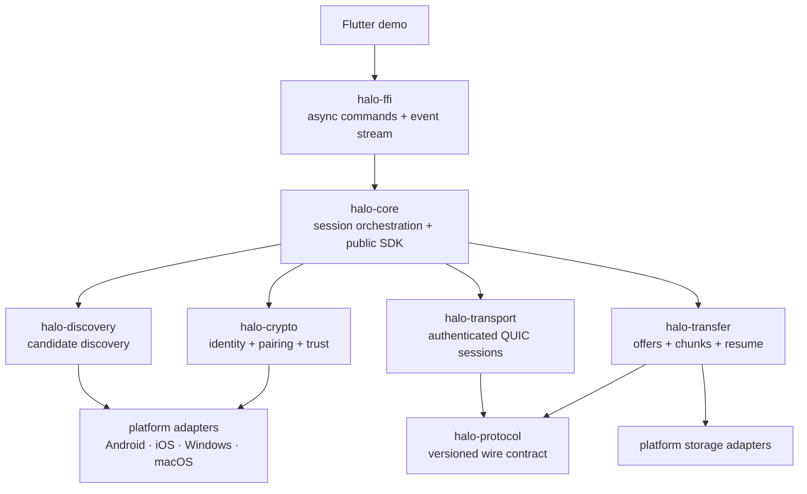
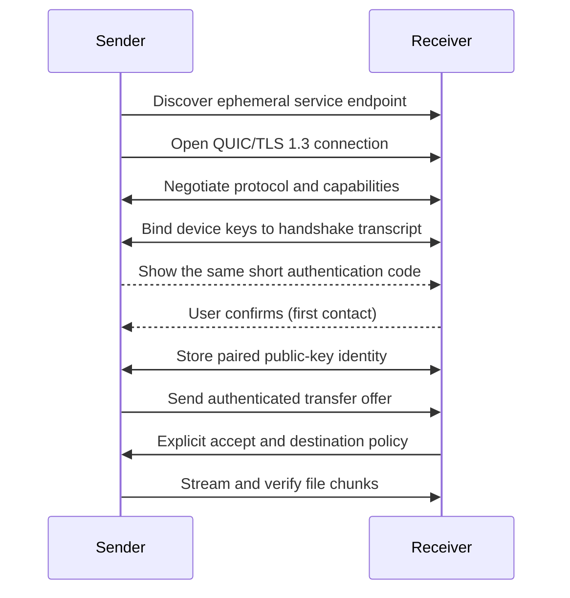

# Halo

[English](README.md) | [简体中文](README.zh-CN.md)

Halo is an open, account-free, cross-platform nearby connectivity protocol and
Rust SDK. Its first reference application transfers files directly between
Android, iOS, Windows, and macOS through a Flutter UI.

> Project status: early implementation. The repository now contains one shared
> Flutter discovery demo for Android, iOS, and macOS, backed by the Rust
> discovery core and narrow native BLE drivers. Android ↔ macOS has passed a
> physical-device check; iOS currently has an arm64 build but still needs
> physical-device interoperability testing. The Rust core now has an
> experimental TLS-bound pairing protocol, QUIC listener/client, protected
> identity adapters, remembered-peer persistence, and a Flutter consent flow.
> The integrated flow passes host loopback and Android/macOS compile checks, but
> has not yet been verified between physical Android and macOS devices. There is
> no SDK release, secure file-transfer implementation, or four-platform
> validation.

Halo is not an AirDrop implementation and does not attempt to reverse engineer
Apple's private stack. The near-term promise is smaller and testable: when two
devices have Halo open and share a reachable local network, they can discover
one another, establish trust, and transfer files securely without an account or
cloud relay.

## Why Halo

Most polished nearby-transfer products are tied to one vendor ecosystem. Other
tools work across platforms but often couple discovery, networking, UI, and file
handling into a single application. Halo treats these as a reusable connectivity
layer:

```text
Flutter demo / third-party application
                  │
             Halo Rust SDK
       ┌──────────┼──────────┐
   discovery   secure link   services
                              ├─ file transfer (first)
                              ├─ clipboard (future)
                              ├─ device messages (future)
                              └─ media / input capabilities (research)
```

The project succeeds if independently built applications can use the same open
protocol to connect safely. A fast demo app alone is not enough.

## Product principles

- **Cross-platform by contract.** Protocol behavior is shared; platform limits
  are exposed explicitly instead of hidden behind optimistic UI.
- **Local first.** Data travels directly on the local network whenever possible.
  The MVP has no account, central directory, analytics requirement, or cloud
  relay.
- **Consent before trust.** Seeing a device nearby does not authorize it. New
  peers must be accepted and cryptographically verified.
- **Private by default.** Encrypt transfers, minimize advertised metadata, and
  never upload content implicitly.
- **Recoverable.** Cancellation, interruption, retry, and resume are normal
  states, not exceptional edge cases.
- **Embeddable.** Rust owns the protocol and core behavior; Flutter is the first
  client of a deliberately small SDK.
- **One localized UI.** Every product target uses the same Flutter screens,
  currently localized in English and Simplified Chinese and selected from the
  system locale.
- **Measurable.** Performance claims include the test environment and never
  override correctness or integrity checks.

## Scope

### MVP user story

1. Open Halo on a sender and receiver connected to the same LAN.
2. Select a visible device and one or more files.
3. On first contact, compare a short authentication code and accept the peer.
4. The receiver reviews the offer and chooses a destination.
5. Halo transfers encrypted data, displays progress, verifies each file, and
   finalizes it safely.
6. An interrupted transfer can resume while its authenticated session metadata
   remains valid.

### MVP includes

- Android, iOS, Windows, and macOS demo applications
- Concurrent foreground discovery using BLE rendezvous, mDNS/DNS-SD, IPv4/IPv6
  presence multicast, directed broadcast, and remembered-endpoint probes
- Direct encrypted transport over QUIC
- Explicit pairing and a remembered-peer model
- Multi-file offers, progress, cancellation, retry, and bounded concurrency
- Chunk-level integrity plus final whole-file verification
- Resumable transfers using an authenticated manifest
- Clear permission, reachability, disk-space, and compatibility errors
- A documented, versioned protocol and a narrow Rust SDK

### Not in MVP

- AirDrop or Quick Share wire compatibility
- System share-sheet integration before the core flow is stable
- Guaranteed discovery or transfer while either app is backgrounded
- Internet rendezvous, NAT traversal, cloud relay, or user accounts
- Folder synchronization, clipboard sync, screen casting, keyboard/mouse sharing,
  or camera streaming
- A universal throughput guarantee such as `100 MB/s`

Those exclusions are sequencing decisions, not claims that every item is
possible on every platform.

## Platform expectations

| Platform | MVP discovery | MVP transport | Important constraint |
| --- | --- | --- | --- |
| Android | BLE + parallel LAN providers | QUIC over LAN | BLE, Wi-Fi/multicast behavior, and permissions vary by OS and vendor |
| iOS | CoreBluetooth + Bonjour + LAN presence | QUIC over LAN | Local-network, Bluetooth, and background execution restrictions apply |
| Windows | WinRT BLE + parallel LAN providers | QUIC over LAN | Hardware, firewall, and network profile can limit individual providers |
| macOS | CoreBluetooth + Bonjour + LAN presence | QUIC over LAN | Current demo is Apple Silicon-only; permissions, sandbox, and signing rules depend on distribution |

BLE rendezvous is required in the first discovery milestone and runs in parallel
with LAN providers when permission and hardware allow. It advertises minimal,
rotating presence data, does not transport files, and does not establish identity
by itself. Provider unavailability is reported explicitly while other providers
continue running.

Linux is a desired core/CLI validation target after the protocol workspace is
running, but a Linux Flutter demo is not part of the first four-platform
milestone.

## Architecture

Halo separates discovery, trust, transport, and services so each can evolve
without leaking platform behavior into the wire protocol.

The detailed discovery design is currently available in Simplified Chinese at
[`docs/architecture/discovery.zh-CN.md`](docs/architecture/discovery.zh-CN.md).



### Public SDK boundary

Rust applications depend only on `halo-core`. It owns discovery and pairing
services and exposes product-level configuration, events, consent, and shutdown
operations. `halo-protocol`, `halo-crypto`, `halo-discovery`, and
`halo-transport` are workspace implementation crates; they are not separate SDK
integration requirements and are currently marked `publish = false`.

During repository development, a Rust client uses one dependency:

```toml
[dependencies]
halo-core = { path = "path/to/Halo/crates/halo-core" }
```

```rust,no_run
use halo_core::{PairingConfig, PairingService};

# async fn example() -> Result<(), Box<dyn std::error::Error>> {
let startup = PairingService::start(PairingConfig::new("/app/private/halo-trust")).await?;
let advertised_port = startup.listen_port;
// Persist startup.new_identity_blob() with the platform protected-blob adapter
// before advertising advertised_port.
# let _ = advertised_port;
# Ok(())
# }
```

Flutter consumes one generated plugin API, Android packaging will expose one
AAR, and Apple packaging will expose one XCFramework. Those artifacts embed the
internal Rust crates; application developers do not select or coordinate them.
`halo-ffi` is intentionally a thin conversion and handle layer over
`halo-core`.

### Control plane

The control plane handles:

- capability and protocol-version negotiation
- pairing and trust decisions
- file manifests and transfer offers
- accept/reject/cancel messages
- progress, retry, and resume coordination

### Data plane

The data plane sends bounded file chunks over one or more QUIC streams. It uses
backpressure, avoids loading whole files into memory, and verifies chunks before
recording them as durable. A completed file is checked against its manifest and
moved from private staging to the chosen destination.

This separation leaves room for a future transport—such as Wi-Fi Direct on a
subset of platforms—without changing the transfer UX or public service API.

## Discovery, connection, and trust

Discovery answers only “where might a compatible Halo endpoint be?” It is not a
security boundary.

The proposed first flow is:



The exact pairing construction, certificate verification policy, key rotation,
and short-code derivation must be specified in a threat model and reviewed
before implementation is declared stable. Halo will use established TLS and
cryptographic libraries rather than a custom cipher or handshake.

### Threats explicitly in scope

- A nearby attacker impersonating a discovered device
- Man-in-the-middle attacks during first contact
- Passive observation of discovery traffic
- Malformed messages and resource-exhaustion attempts
- Path traversal, reserved names, links, overwrite races, and archive bombs
- Corruption, truncation, duplication, replay, and malicious resume state
- Lost or stolen devices retaining trust credentials

The MVP does not claim anonymity against network operators or protection after
an endpoint OS is compromised.

## Proposed Rust SDK

The public API should describe intent and state, not sockets or Flutter details.
The following sketch is illustrative; names may change through an ADR and API
review:

```rust,ignore
let halo = Halo::builder()
    .device_name("Sam's laptop")
    .identity_store(platform_identity_store)
    .discovery(platform_discovery)
    .receive_policy(receive_policy)
    .build()
    .await?;

let mut events = halo.events();
halo.start_discovery().await?;

while let Some(event) = events.next().await {
    match event {
        HaloEvent::PeerFound(peer) => render_peer(peer),
        HaloEvent::PairingRequested(request) => render_pairing(request),
        HaloEvent::TransferOffered(offer) => render_offer(offer),
        HaloEvent::TransferProgress(progress) => render_progress(progress),
        _ => {}
    }
}
```

Initial SDK capabilities should map to a small set of asynchronous operations:

```text
start_discovery() / stop_discovery()
pair(peer_id) / confirm_pairing(request_id) / reject_pairing(request_id)
offer_files(peer_id, file_sources)
accept_transfer(transfer_id, destination) / reject_transfer(transfer_id)
pause(transfer_id) / resume(transfer_id) / cancel(transfer_id)
events() -> bounded event stream
capabilities() -> platform/runtime capability report
```

Opaque IDs cross the FFI boundary. Rust retains ownership of sockets, keys,
tasks, transfer state, and error classification. Dart receives immutable view
models and invokes coarse commands.

## Repository layout

```text
Halo/
├── AGENTS.md
├── README.md
├── README.zh-CN.md
├── Cargo.toml
├── crates/
│   ├── halo-core/
│   ├── halo-protocol/
│   ├── halo-discovery/
│   ├── halo-transport/
│   ├── halo-transfer/
│   ├── halo-crypto/
│   └── halo-ffi/
├── platform/{android,ios,macos,windows}/
├── apps/halo_demo/
├── protocol/
├── docs/{adr,architecture,security,benchmarks}/
└── tools/
```

The experimental discovery and pairing core uses Tokio for async execution,
Quinn for QUIC, rustls for TLS, P-256 and HKDF-SHA-256 for pairing, and
`flutter_rust_bridge` for generated Dart/Rust bindings. BLAKE3 remains a
candidate for future content digests. Dependencies are not considered
cross-platform validated until the relevant physical-device matrix passes.

## Delivery plan

### Phase 0 — contracts and risks

- Write protocol framing/state-machine draft and compatibility policy
- Write threat model and pairing ADR
- Prototype Rust-to-Flutter calls on all four targets
- Spike Bonjour/mDNS visibility and QUIC connectivity on real devices
- Establish CI, reproducible toolchains, license policy, and test fixtures

Exit: all four apps can call one Rust function, report capabilities, and exchange
an authenticated “hello” on at least one representative LAN.

### Phase 1 — vertical slice

- macOS ↔ Windows discovery and one-file transfer
- Explicit first-contact verification
- Streaming I/O, cancellation, progress, digest verification, safe staging
- Protocol golden vectors and failure-injection integration tests

Exit: a repeatable cross-platform transfer demo with documented measurements and
no known silent-corruption path.

### Phase 2 — mobile foreground support

- Android and iOS adapters, permission education, lifecycle handling
- Desktop ↔ mobile and mobile ↔ mobile interoperability matrix
- Multi-file offers, destination policy, disk-space errors, retry
- Signed/notarized development artifacts where applicable

Exit: the core foreground flow passes on Android, iOS, Windows, and macOS real
devices on supported OS versions.

### Phase 3 — resumability and SDK preview

- Authenticated resumable manifests and durable chunk maps
- Remembered peers, revocation, key rotation, and migration behavior
- Stable error taxonomy, API docs, sample integration, package automation
- Fuzzing, cross-version suites, performance and battery baselines

Exit: `0.1` SDK preview with an explicit compatibility window and published
protocol specification.

### Phase 4 — nearby platform experiments

- BLE-assisted rendezvous where useful and permitted
- Clipboard or small-message service as the second protocol consumer
- Evaluate Wi-Fi Direct/NAN, internet rendezvous, and relays separately per OS
- Investigate third-party implementations and conformance testing

These are research tracks, not commitments for the MVP.

## Success criteria

The first public preview should meet measurable criteria:

- The same protocol implementation transfers files among all four target demos.
- Every byte is encrypted in transit and every completed file is verified.
- First-contact impersonation is detectable through an explicit verification
  ceremony documented in the threat model.
- Cancellation leaves no final file; interruption leaves only bounded, private,
  resumable state.
- A 10 GiB file can stream with bounded memory on each target.
- Failures are actionable: permission, discovery, version, trust, disk, network,
  and integrity errors are distinguishable.
- Benchmarks publish median and tail throughput, discovery time, setup time,
  memory, CPU, and energy where measurable—along with hardware and network data.

`100 MB/s` is a benchmark aspiration on suitable modern local hardware, not a
product guarantee. End-to-end verified throughput and time-to-first-success are
more useful than an isolated socket-speed number.

## Open design decisions

The first ADRs should settle:

1. Wire serialization and framing format
2. QUIC implementation and runtime ownership across mobile lifecycles
3. Pairing handshake, short authentication code, and remembered-peer model
4. Identity-key storage and backup/rotation policy on each platform
5. Manifest, chunk sizing, digest tree, and resume persistence format
6. mDNS service schema, metadata minimization, and endpoint rotation
7. FFI/event-stream design and `flutter_rust_bridge` suitability
8. Minimum OS versions and the support/deprecation policy
9. Licensing for protocol, SDK, demo application, and contributions

Until these ADRs land, this README states direction rather than frozen protocol.

## Development

The Rust workspace and the shared Flutter application are scaffolded. Run the
baseline checks from the repository root:

```bash
cargo fmt --all -- --check
cargo clippy --workspace --all-targets --all-features -- -D warnings
cargo test --workspace --all-features
flutter analyze apps/halo_demo
flutter test apps/halo_demo
```

Run the Android/iOS/macOS discovery demo from `apps/halo_demo`; the native launchers
must not be developed as separate product UIs. The physical-device procedure is
documented in
[`docs/testing/android-macos-discovery.zh-CN.md`](docs/testing/android-macos-discovery.zh-CN.md).
The iOS build and device procedure is documented in
[`docs/testing/ios-discovery.zh-CN.md`](docs/testing/ios-discovery.zh-CN.md).
Current Android, iOS, and macOS demo artifacts are arm64-only. Use a release APK,
not the Flutter debug APK, when evaluating Android distribution size. The
in-app diagnostics sheet shows the independent provider states reported by
Rust.
See
[`AGENTS.md`](AGENTS.md) for architecture boundaries, security rules, testing
expectations, and the contribution workflow.

## License

No license has been selected yet. Until a license file is added, the repository
should not be described or distributed as open source despite the intended open
protocol direction. Licensing is a Phase 0 decision.
