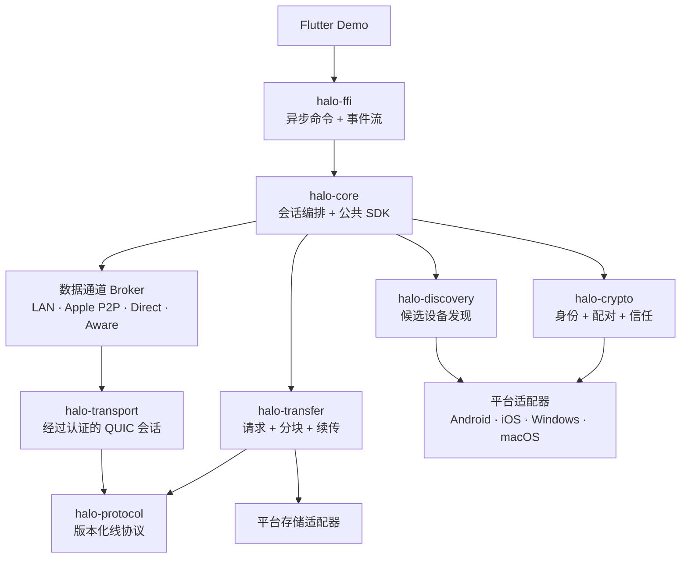
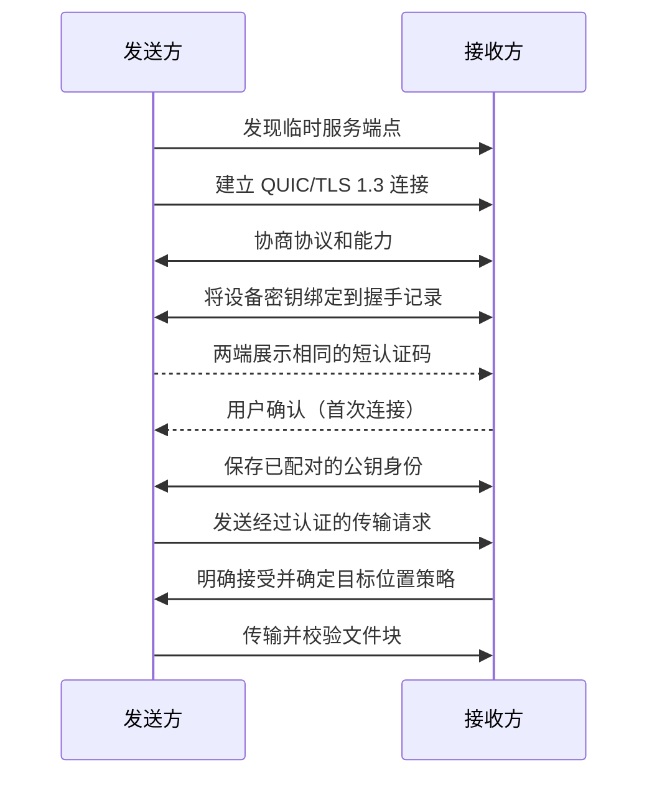

# Halo

[English](README.md) | [简体中文](README.zh-CN.md)

Halo 是一个开放、无需账号、跨平台的近场设备连接协议与 Rust SDK。它的第一个
参考应用通过 Flutter UI，在 Android、iOS、Windows 和 macOS 设备之间直接传输
文件。

> 项目状态：早期实现阶段。仓库现在已有 Android、iOS 和 macOS 共用的 Flutter 发现
> Demo，底层使用 Rust 发现核心与极薄的原生 BLE 驱动。Android ↔ macOS 已完成一次
> 真机互测；iOS arm64 已编译通过，但仍待真机互通验证。目前还没有 SDK 发布版、
> 真机文件传输验证或四端验证。实验性的 TLS 绑定配对协议、QUIC 监听与连接、受保护
> 身份存储、可信设备持久化和 Flutter 同意流程已经接入 Demo，并通过主机回环测试及
> Android、iOS Simulator、macOS 编译检查，但尚未完成 Android ↔ macOS 配对真机
> 验证。LAN 配对后
> QUIC 会话保留和 Rust 单文件校验/安全落盘核心已经实现；共享 Demo 也已接入
> Android/macOS 原生文件选择、接收确认和取消流程，文件字节不经过 Dart。通用数据
> 通道 Broker 已实现非计费本地路径、接口绑定声明、有界系统提示和认证后胜出策略。
> Android 现在由 Kotlin 将固定到指定 OS Network 的 UDP socket 直接移交 Rust；没有
> 合格非计费 LAN 时只监听 loopback。iOS/macOS 现在使用 `IP_BOUND_IF` 将 IPv4 UDP
> socket 固定到 Network.framework 选出的合格 Wi-Fi/以太网接口，再直接移交 Rust；
> Windows LAN 精确绑定与 Direct/Aware 适配器仍待完成。主机回环与主机构建已通过，
> 但 Android ↔ macOS 真机文件传输仍未验证。

Halo 不是 AirDrop 的实现，也不会尝试逆向 Apple 的私有技术栈。近期目标更小，也
更容易验证：当两台设备都打开 Halo，并处于彼此可达的同一局域网时，它们能够互相
发现、建立信任，并在不依赖账号和云端中转的情况下安全地传输文件。

本文是默认英文 [README](README.md) 的简体中文版本。若两个版本出现含义差异，
以英文版和协议规范为准。

## 为什么做 Halo

目前体验成熟的近场传输产品大多绑定在单一厂商生态中。其他跨平台工具虽然可以使用，
但经常把发现、网络、UI 和文件处理耦合在一个应用里。Halo 将这些能力设计成可复用的
设备连接层：

```text
Flutter Demo / 第三方应用
             │
        Halo Rust SDK
    ┌────────┼────────┐
 设备发现   安全连接   服务
                     ├─ 文件传输（首个服务）
                     ├─ 剪贴板（未来）
                     ├─ 设备消息（未来）
                     └─ 媒体与输入能力（研究方向）
```

如果由不同团队独立构建的应用可以通过同一个开放协议安全连接，项目才算真正成功。
只有一个速度很快的 Demo 还不够。

## 产品原则

- **以协议保证跨平台。** 各平台共享同一套协议行为；平台限制需要明确暴露，而不是
  被乐观的 UI 隐藏。
- **本地优先。** 数据应尽可能在局域网内直接传输。MVP 不依赖账号、中央设备目录、
  数据分析或云端中继。
- **先确认，再信任。** 发现附近设备不代表获得授权。新设备必须经过用户接受和
  密码学验证。
- **默认保护隐私。** 传输全程加密，尽量减少广播信息，绝不隐式上传用户内容。
- **可恢复。** 取消、中断、重试和续传都是正常状态，不是偶发异常。
- **可嵌入。** Rust 负责协议和核心行为；Flutter 是这个小型 SDK 的第一个客户端。
- **只有一套本地化 UI。** 所有产品端共用 Flutter 页面，目前提供英文和简体中文，并
  根据系统语言自动选择。
- **可衡量。** 所有性能结果都必须包含测试环境，并且不能以牺牲正确性或完整性为
  代价。

## 项目范围

### MVP 用户流程

1. 发送端和接收端连接到同一局域网，并打开 Halo。
2. 选择一个可见设备，以及一个或多个待发送文件。
3. 首次连接时，双方比对短认证码并确认对方身份。
4. 接收方查看文件列表并选择保存位置。
5. Halo 加密传输数据、展示进度、校验每个文件，然后安全地完成写入。
6. 只要经过认证的会话元数据仍然有效，中断的传输就可以继续。

### MVP 包含

- Android、iOS、Windows 和 macOS Demo 应用
- 并行运行 BLE 会合、mDNS/DNS-SD、IPv4/IPv6 Presence 组播、子网定向广播和
  已配对地址直探
- 基于 QUIC 的端到端直接加密传输
- 明确的配对流程和已信任设备模型
- 多文件传输请求、进度、取消、重试和有界并发
- 分块完整性校验与最终的整文件校验
- 使用经过认证的清单恢复中断传输
- 清晰展示权限、网络可达性、磁盘空间和协议兼容性错误
- 有文档、可版本化的协议，以及边界清晰的 Rust SDK

### MVP 不包含

- 与 AirDrop 或 Quick Share 的协议兼容
- 在核心流程稳定前接入系统分享面板
- 保证所有平台具有完全一致的后台发现能力
- 互联网会合、NAT 穿透、云端中继或用户账号
- 文件夹同步、剪贴板同步、投屏、键鼠共享或摄像头串流
- 类似 `100 MB/s` 的通用吞吐量承诺

这些排除项只是开发顺序上的选择，并不表示它们在所有平台上都一定可行。

当前实验版 Android Demo 会在用户明确开始发现后，通过可见的前台服务通知维持后台
发现；macOS Demo 会在应用进程仍运行时继续发现。这不保证能够跨越强制停止、进程
退出、系统睡眠、权限撤销、厂商省电策略或 iOS 后台限制。

## 平台预期

| 平台 | 发现方式 | 四端共同基线 | 点对点数据通道计划 |
| --- | --- | --- | --- |
| Android | BLE + 并行 LAN Provider | 局域网 QUIC | Wi-Fi Direct、Wi-Fi Aware |
| iOS/iPadOS | CoreBluetooth + Bonjour + LAN Presence | 局域网 QUIC | Apple 点对点 Wi-Fi；受支持的 iOS/iPadOS 26 设备使用 Wi-Fi Aware |
| Windows | WinRT BLE + 并行 LAN Provider | 局域网 QUIC | Wi-Fi Direct |
| macOS | CoreBluetooth + Bonjour + LAN Presence | 局域网 QUIC | Apple 点对点 Wi-Fi |

BLE 会合属于首批发现能力，在权限和硬件允许时与 LAN Provider 并行运行。它只广播
最小化、可轮换的 Presence 信息，不负责传输文件，也不能单独证明设备身份。某个
Provider 不可用时必须明确报告原因，其他 Provider 继续运行。

Apple 点对点 Wi-Fi、Wi-Fi Direct 和 Wi-Fi Aware 是正式的数据通道 Provider，
不是三套不同的文件协议。它们都只负责在同一套认证 QUIC 与传输协议下方建立合格的
本地链路。每个平台组合在通过真机验收前仍标记为 `planned`；蜂窝网络和互联网不会
成为隐式回退。完整设计见
[`docs/architecture/data-channels.md`](docs/architecture/data-channels.md) 与
[`ADR 0007`](docs/adr/0007-multi-bearer-data-channels.md)。

在协议工作区稳定后，我们希望把 Linux 作为 Rust 核心和 CLI 的验证目标，但第一阶段
的四端里程碑不包含 Linux Flutter Demo。

## 架构

Halo 将设备发现、信任、传输和上层服务拆开，使各部分可以独立演进，同时避免平台
行为泄漏到公共协议中。

发现子系统的完整中文设计见
[`docs/architecture/discovery.zh-CN.md`](docs/architecture/discovery.zh-CN.md)。该设计将
BLE、mDNS、IPv4/IPv6 Presence、子网广播和已配对地址直探纳入首批并行能力。
多承载数据通道设计见
[`docs/architecture/data-channels.md`](docs/architecture/data-channels.md)。



### 公共 SDK 边界

Rust 应用只依赖 `halo-core`。设备发现、连接、配对、同意事件和关闭流程都由这个统一
入口提供。`halo-protocol`、`halo-crypto`、`halo-discovery` 和 `halo-transport` 是
工作区内部实现 crate，不是 SDK 使用方需要分别接入的组件，目前均设置为
`publish = false`。

仓库开发阶段，Rust 调用方只需要一个依赖：

```toml
[dependencies]
halo-core = { path = "path/to/Halo/crates/halo-core" }
```

Flutter 对外只有一套生成接口；后续 Android 发布一个 AAR，Apple 发布一个
XCFramework。底层 crate 会被打进这些产物，业务方不需要感知或协调它们。
`halo-ffi` 现在只负责 `halo-core` 与 Flutter 之间的句柄和类型转换。

### 控制面

控制面负责：

- 能力和协议版本协商
- 配对和信任决策
- 文件清单与传输请求
- 接受、拒绝和取消消息
- 进度、重试与续传协调

### 数据面

数据面通过一个或多个 QUIC 流发送有大小限制的文件块。它需要支持背压，避免把整个
文件加载进内存，并在记录分块已经持久化之前完成校验。文件接收完成后，Halo 会根据
清单再次校验，再将文件从私有暂存区移动到用户选择的位置。

数据通道 Broker 会让局域网、Apple 点对点 Wi-Fi、Wi-Fi Direct 和 Wi-Fi Aware
共用这套传输模型，而不必重新设计传输体验或公共服务 API。

## 发现、连接与信任

设备发现只能回答“哪里可能存在兼容的 Halo 端点”，它不是安全边界。

第一版连接流程计划如下：



配对算法、证书验证策略、密钥轮换方式和短码派生方式，必须先在威胁模型中明确并接受
审查，才能被标记为稳定。Halo 会使用成熟的 TLS 与密码学库，而不会自创加密算法或
握手协议。

### 明确纳入范围的威胁

- 附近攻击者冒充已发现设备
- 首次连接时的中间人攻击
- 被动监听设备发现流量
- 恶意协议消息和资源耗尽攻击
- 路径穿越、系统保留名称、链接、覆盖竞争和压缩炸弹
- 数据损坏、截断、重复、重放和恶意续传状态
- 设备丢失或被盗后仍保留信任凭据

MVP 不承诺向网络运营者隐藏设备，也无法在终端操作系统已经失陷后继续保护数据。

## Rust SDK 草案

公共 API 应表达用户意图和业务状态，而不是暴露 Socket 或 Flutter 实现细节。下面的
代码只用于表达方向；最终命名需要经过 ADR 和 API 评审：

```rust,ignore
let halo = Halo::builder()
    .device_name("Sam's laptop")
    .identity_store(platform_identity_store)
    .discovery(platform_discovery)
    .receive_policy(receive_policy)
    .build()
    .await?;

let mut events = halo.events();
halo.start_discovery().await?;

while let Some(event) = events.next().await {
    match event {
        HaloEvent::PeerFound(peer) => render_peer(peer),
        HaloEvent::PairingRequested(request) => render_pairing(request),
        HaloEvent::TransferOffered(offer) => render_offer(offer),
        HaloEvent::TransferProgress(progress) => render_progress(progress),
        _ => {}
    }
}
```

首批 SDK 能力应对应一组精简的异步操作：

```text
start_discovery() / stop_discovery()
pair(peer_id) / confirm_pairing(request_id) / reject_pairing(request_id)
offer_files(peer_id, file_sources)
accept_transfer(transfer_id, destination) / reject_transfer(transfer_id)
pause(transfer_id) / resume(transfer_id) / cancel(transfer_id)
events() -> 有界事件流
capabilities() -> 平台和运行时能力报告
```

FFI 边界只传递不透明 ID。Rust 负责 Socket、密钥、任务、传输状态和错误分类；Dart
接收不可变的视图模型，并调用较粗粒度的命令。

## 仓库结构

```text
Halo/
├── AGENTS.md
├── README.md
├── README.zh-CN.md
├── Cargo.toml
├── crates/
│   ├── halo-core/
│   ├── halo-protocol/
│   ├── halo-discovery/
│   ├── halo-transport/
│   ├── halo-transfer/
│   ├── halo-crypto/
│   └── halo-ffi/
├── platform/{android,ios,macos,windows}/
├── apps/halo_demo/
├── protocol/
├── docs/{adr,architecture,security,benchmarks}/
└── tools/
```

实验阶段的发现与配对核心使用 Tokio（异步执行）、Quinn（QUIC）、rustls（TLS）、
P-256、HKDF-SHA-256 和 `flutter_rust_bridge`（生成 Dart/Rust 绑定）。BLAKE3 仍只是
未来内容摘要的候选。相关真机矩阵通过之前，这些依赖不能被描述为已经完成跨平台验证。

## 交付计划

### Phase 0 — 确立契约与风险

- 编写协议帧、状态机草案和兼容性策略
- 编写威胁模型和配对 ADR
- 在四个平台验证 Rust 到 Flutter 的调用链路
- 在真实设备上验证 Bonjour/mDNS 可见性和 QUIC 连接
- 建立 CI、可复现工具链、许可证策略和测试夹具

退出条件：四个平台的应用都能调用同一个 Rust 函数、报告平台能力，并且至少能在一个
有代表性的局域网环境中交换经过认证的 `hello` 消息。

### Phase 1 — 端到端垂直切片

- 完成 macOS ↔ Windows 发现和单文件传输
- 完成首次连接时的明确身份验证
- 支持流式 I/O、取消、进度、摘要校验和安全暂存
- 建立协议黄金测试向量和故障注入集成测试

退出条件：跨平台传输 Demo 可以稳定复现，有完整的性能测试环境说明，并且不存在已知
的静默数据损坏路径。

### Phase 2 — 移动端前台支持

- 实现 Android 和 iOS 适配器、权限引导与生命周期处理
- 建立桌面端 ↔ 移动端、移动端 ↔ 移动端互操作矩阵
- 支持多文件请求、保存策略、磁盘空间错误和重试
- 在适用平台生成经过签名、公证的开发产物

退出条件：核心前台流程在受支持版本的 Android、iOS、Windows 和 macOS 真机上
全部通过。

### Phase 3 — 可恢复传输与 SDK 预览版

- 实现经过认证的续传清单和持久化分块状态图
- 完善已信任设备、撤销、密钥轮换与迁移行为
- 稳定错误分类、API 文档、示例集成和打包自动化
- 建立模糊测试、跨版本测试、性能与能耗基线

退出条件：发布 `0.1` SDK 预览版，明确兼容窗口，并公开协议规范。

### Phase 4 — 无基础设施数据通道

- Provider 基础已落地：四类 bearer、本地路径限定的有界候选竞速，以及带有
  exporter 绑定 Swift/Rust 直连配对桥、可保留认证 QUIC group 和有界数据记录的
  Apple Network.framework P2P 适配器（仍为 `planned`；传输接线与真机门槛待完成）
- 为受支持的 Apple 设备组合实现 Apple 点对点 Wi-Fi Provider
- 实现 Wi-Fi Direct Provider，并完成 Android ↔ Windows 互通矩阵
- 为受支持的 Android 与 iOS/iPadOS 设备实现 Wi-Fi Aware Provider
- 完成有界通道竞速、明确的能力 UI、资源释放与禁止蜂窝回退测试
- 将剪贴板或小消息作为第二个协议消费者

这些 Provider 已纳入 Halo 的分阶段数据通道计划，但在通过文档规定的真机门槛前
保持 `planned`。互联网会合、NAT 穿透、云端中继和用户账号仍是独立的非 MVP 研究项。

## 成功标准

第一个公开预览版应满足以下可衡量标准：

- 四个平台的 Demo 使用同一套协议实现互传文件。
- 所有数据在传输过程中加密，所有完成的文件均经过校验。
- 首次连接时的冒充行为可以通过明确的验证仪式被发现，并记录在威胁模型中。
- 取消操作不会留下最终文件；中断后只保留有大小限制、私有且可恢复的状态。
- 每个平台都能以有界内存流式传输一个 10 GiB 文件。
- 错误可以指导用户采取行动：权限、发现、版本、信任、磁盘、网络和完整性错误能够
  被区分。
- 性能测试公开吞吐量中位数和尾部延迟、设备发现耗时、连接耗时、内存、CPU，以及
  在可测量平台上的能耗，同时附带硬件和网络环境信息。

`100 MB/s` 是在适当的新型局域网硬件上的测试目标，不是产品保证。经过端到端校验的
实际吞吐量和首次成功时间，比孤立的 Socket 速度更有意义。

## 待决设计问题

第一批 ADR 需要确定：

1. 线协议序列化与帧格式
2. QUIC 实现，以及移动端生命周期中的运行时所有权
3. 配对握手、短认证码和已信任设备模型
4. 各平台的身份密钥存储、备份和轮换策略
5. 清单、分块大小、摘要树和续传持久化格式
6. mDNS 服务结构、元数据最小化和端点轮换方式
7. FFI/事件流设计，以及 `flutter_rust_bridge` 是否适用
8. 最低操作系统版本和支持/弃用策略
9. 协议、SDK、Demo 应用及贡献代码的许可证

在这些 ADR 完成之前，README 表达的是项目方向，而不是已经冻结的协议。

## 开发

Rust Workspace 和共用 Flutter 应用已经完成脚手架。请在仓库根目录执行基础检查：

```bash
cargo fmt --all -- --check
cargo clippy --workspace --all-targets --all-features -- -D warnings
cargo test --workspace --all-features
flutter analyze apps/halo_demo
(cd apps/halo_demo && flutter test)
```

Android、iOS 与 macOS 从 `apps/halo_demo` 启动同一个 Flutter 应用；原生 Launcher
不得演变成另一套产品 UI。Android/macOS 真机互测步骤见
[`docs/testing/android-macos-discovery.zh-CN.md`](docs/testing/android-macos-discovery.zh-CN.md)。
iOS 构建和真机步骤见
[`docs/testing/ios-discovery.zh-CN.md`](docs/testing/ios-discovery.zh-CN.md)。当前 Android、
iOS 与 macOS Demo 仅生成 arm64 产物；评估 Android 分发体积时应使用 Release APK，
而不是包含 Flutter 调试运行时的 Debug APK。应用内“发现诊断”会展示 Rust 报告的各个
Provider 独立状态。
架构边界、安全规则、测试要求和变更流程请参阅 [`AGENTS.md`](AGENTS.md)。

## 许可证

项目尚未选择许可证。在许可证文件加入仓库之前，即使我们的目标是开放协议，也不应
将该仓库描述或分发为开源项目。许可证选择属于 Phase 0 的工作。
