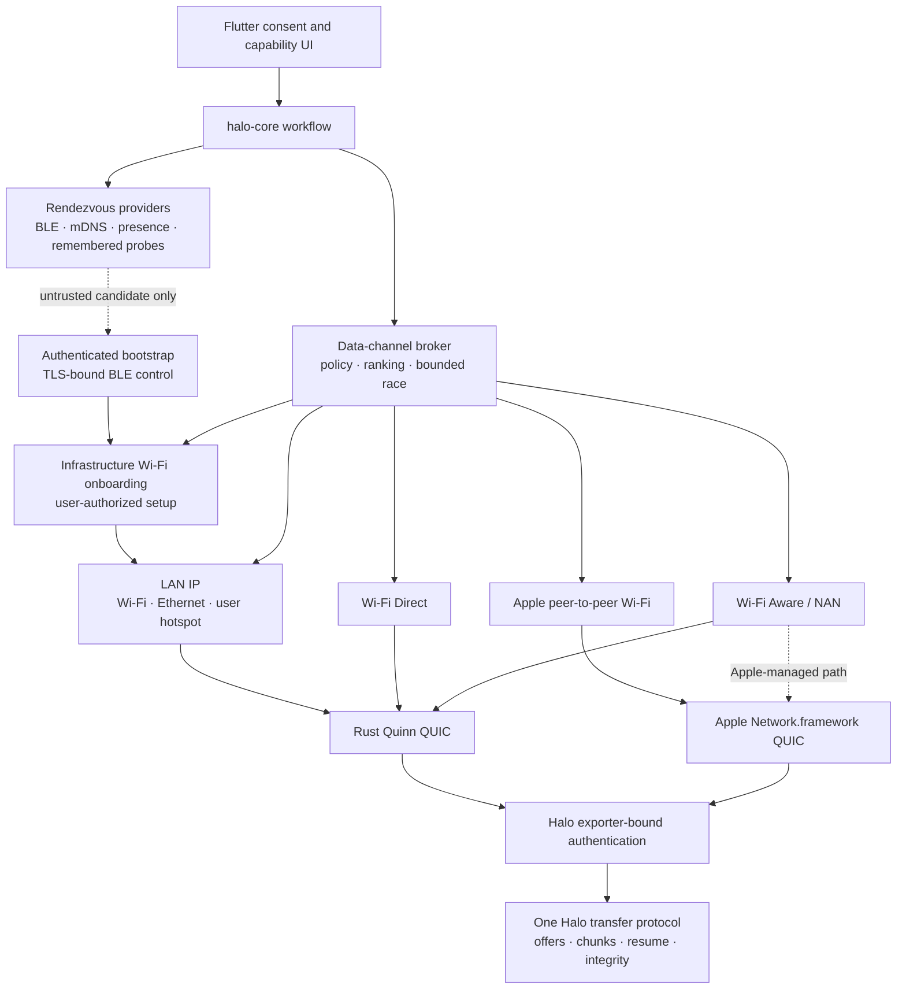

# Halo data-channel architecture

- Status: Accepted design; providers carry individual support labels
- Updated: 2026-08-05
- Active scope: Android ↔ macOS, Android ↔ Android, and macOS ↔ macOS regression
- Deferred scope: iOS/iPadOS and Windows

## Decision summary

Halo transfers files over authenticated QUIC. BLE, infrastructure Wi-Fi,
Ethernet, Apple peer-to-peer Wi-Fi, Wi-Fi Direct, and Wi-Fi Aware do not define
different file protocols. They are discovery or bearer mechanisms below one
versioned Halo control and data plane.

There is no single public infrastructure-free bearer for every platform pair.
Halo therefore implements independent providers and exposes their availability
honestly:

- Android and macOS are the active product platforms. Android ↔ macOS and
  Android ↔ Android are required transfer paths; macOS ↔ macOS is a regression
  path. iOS/iPadOS and Windows product work is deferred by
  [ADR 0010](../adr/0010-android-macos-first-delivery.md).

- LAN IP is the universal baseline.
- Apple peer-to-peer Wi-Fi is the direct Apple-to-Apple path.
- Wi-Fi Direct is the direct Android/Windows path.
- Wi-Fi Aware is the standards-based direct Android path and the planned path
  between Android and supported iOS/iPadOS devices.
- User-authorized infrastructure Wi-Fi onboarding may move a peer onto the
  sender's eligible current Wi-Fi, after which it is an ordinary LAN path.
- A separate authenticated BLE bootstrap may carry a one-use Wi-Fi invitation;
  ordinary BLE discovery still carries no secret and BLE never carries files.
- A user-created hotspot is the local fallback after an existing shared LAN.
- BLE never carries file contents.
- Cellular and Internet paths are prohibited for the nearby-only product mode.

The active preference is strict: an existing shared Wi-Fi/Ethernet LAN first,
then a user-prepared local hotspot, otherwise no transfer path. Direct providers
remain future optimizations and cellular/public-Internet/relay paths are not
implemented or scheduled.

`planned` below means the provider is part of the architecture and delivery
plan. It does not mean the current repository has passed its device matrix.

## Implementation status

The repository now contains the first provider foundation and an authenticated
Apple control-channel integration, without elevating any direct provider to
device-validated support:

- `halo-transport` defines the four data-channel kinds, independent runtime
  capability states, opaque peer/candidate handles, path classes, bounded
  candidate collection, ranking, staggered establishment, cancellation, and a
  hard rejection of cellular, Internet, and unknown paths.
- The shared Apple package contains a Network.framework Apple P2P provider. It
  browses and listens for `_halo._udp`, requires the `halo-pairing/1` ALPN,
  enables peer-to-peer networking, requires a Wi-Fi interface, prohibits
  cellular, revalidates the ready path, emits only opaque handles, and bounds
  candidates and connection attempts.
- The Apple demo creates an in-memory P-256 TLS identity, resolves each
  peer-to-peer Bonjour service to a host/port endpoint, creates a
  `NWConnectionGroup` QUIC tunnel, and opens a separate `NWConnection` stream
  for pairing. A narrow synchronous C ABI copies only bounded complete frames
  directly between Swift and the Rust pairing mailbox; exporter material and
  protocol bytes never pass through Dart or a Flutter platform channel.
  The temporary certificate is not trusted as a peer identity; exporter-bound
  signed Halo pairing remains mandatory. No no-AP real-device matrix has
  passed, so Apple P2P remains `planned`, not `experimental`.
- Successful pairing retains the authenticated connection group and its
  exporter binding. The native provider can open or accept additional bounded
  QUIC streams, verifies that each stream exports the same binding, and
  recognizes the v1 64-byte file-record header with a 256 KiB
  payload cap.
  Rust transfer-service ownership of those streams is not wired yet, so this
  is data-stream foundation rather than a completed file-transfer path.
- The common LAN pairing path now ends only its pairing stream and retains the
  authenticated Quinn connection in `halo-core`. Each retained session has an
  opaque session ID and negotiated application protocol version. The transfer
  coordinator serializes one batch per session and handles manifest consent,
  pause, retry, cancellation, completion, and trust revocation.
- `halo-transfer` implements the single v1 format with bounded multi-file
  manifests, ordered chunks, peer-bound durable sender jobs,
  receiver chunk-prefix state, disk-space admission, whole-file verification,
  and all-or-rollback no-overwrite finalization. Android's document picker and
  macOS's open panel copy up to eight selected sources into private native
  storage; Dart receives paths and state but never file bytes. Remembered
  endpoint probes use a second socket pinned to the same exact OS network or
  interface as Quinn. A host loopback
  test passes and Android/macOS Debug artifacts compile. Physical Android ↔
  macOS and Android ↔ Android file transfer are still unverified.
- Wi-Fi Direct and Wi-Fi Aware platform adapters are not implemented yet.
  Android now reports hardware/runtime availability separately from
  `provider_not_implemented`; Apple reports Wi-Fi Direct as unsupported and
  distinguishes iOS-version eligibility for Wi-Fi Aware from the missing Halo
  provider. These are capability declarations, not working data paths.

The reusable Rust broker now validates path class, metering knowledge, exact
interface binding, provider/peer correlation, and Halo authentication before a
candidate can win. Ordinary authentication failure closes that bearer and
falls through; a remembered identity change or explicit user rejection stops
the peer-wide attempt. Candidates that can trigger system UI are deferred until
automatic candidates fail and are attempted serially with a bounded prompt
budget. The Apple demo still uses a narrower integration: it prefers a
correlated Apple P2P candidate, otherwise uses LAN, and does not yet plug both
native and Quinn connections into the common authenticated broker.

The current unmetered-only implementation is sufficient for ordinary shared
LAN but is not yet the final hotspot policy. A local-only hotspot may be marked
metered or expensive by the OS even though Halo packets remain on-link. Before
hotspot support ships, the broker and platform attestations must distinguish an
explicitly user-approved, interface-bound local-only network from a cellular or
public route; merely relaxing the cost flag is not sufficient.

The core additionally permits only one outbound ceremony for the same
case-normalized discovery reference at a time, including native platform
channels. After authentication, the cryptographic peer ID is the authority: a
second connection for an already retained peer does not create another session
or consume another transfer slot. Distinct peers remain independently bounded
by the global connection and session limits.

Quinn now accepts a UDP socket that a platform adapter selected, bound, and
validated before ownership crosses into Rust. The QUIC server disables active
address migration. Android passively tracks Wi-Fi and Ethernet paths with
`registerNetworkCallback`, then creates an unconnected UDP socket and selects
an eligible `Network` (preferring the active eligible route),
currently requires `NET_CAPABILITY_NOT_METERED`, binds the socket to that exact Android
`Network`, duplicates and detaches its descriptor,
and transfers ownership directly from Kotlin to Rust through a narrow JNI
boundary. Dart never observes the descriptor. Rust consumes the socket once
and applies fixed local, unmetered, interface-bound properties. If preparation
cannot prove an eligible route or JNI handoff fails, Android listens only on
loopback rather than falling back to a wildcard socket; BLE can still report
independently, but LAN pairing is unavailable.

The Android listener is pinned for the lifetime of the current discovery
session. A change in the process default route does not move it. If the selected
`Network` disappears or becomes ineligible, capability state requests a
discovery restart; hot endpoint replacement is not implemented yet.

iOS and macOS now apply the same ownership rule without routing a descriptor
through Dart. `NWPath` must be satisfied, IPv4- or IPv6-capable, non-expensive,
and not constrained. Swift chooses a Wi-Fi or wired-Ethernet `NWInterface`,
creates dual-stack UDP sockets, applies `IPV6_BOUND_IF` with that interface's
system index, binds ephemeral ports, and transfers the descriptors once through
the native C ABI into Quinn and remembered direct discovery. Ineligible or
failed preparation registers a loopback-only listener. If the selected
interface changes, capability state requires a discovery restart. Windows LAN
binding and hot endpoint replacement remain pending. Wi-Fi Direct and Wi-Fi Aware will
reuse the same owned-socket handoff after their network establishment adapters
exist.
It now retries another discovered LAN endpoint after recoverable transport,
protocol, or authentication failure, and retains only an authenticated
connection, but migration-safe exact-interface integration remains pending.
Flutter therefore requires `local_network: ready` before enabling a LAN
connection and does not treat a discovered address alone as a usable path.

## Layer model



Rendezvous answers “which compatible peer may be nearby?” A data-channel
provider answers “can this process establish a non-cellular path to that peer?”
QUIC and Halo authentication answer “is this path confidential, intact, and
connected to the expected cryptographic identity?” These decisions must remain
separate.

## Non-negotiable invariants

1. Discovery alone never authorizes a transfer.
2. BLE discovery never carries file data, manifests, stable peer IDs, identity
   keys, or Wi-Fi credentials. A separately authenticated TLS-bound BLE control
   channel may carry one one-use onboarding invitation; BLE never carries file
   contents or metadata.
3. Every bearer terminates in the same Halo protocol and authenticated peer
   identity; link-layer pairing is defense in depth, not a replacement.
4. File metadata is disclosed only after Halo authentication succeeds.
5. QUIC 0-RTT is disabled for pairing, offers, acceptance, and file data.
6. A socket or Network.framework connection must be pinned to an eligible
   Wi-Fi, Ethernet, Apple P2P, Wi-Fi Direct, or Wi-Fi Aware path.
7. Cellular, VPN-only, public-Internet, and relay paths are always rejected.
   The transport must not silently migrate to them. An explicitly approved
   local-only hotspot remains a local-network path even if the OS reports its
   cost as metered or expensive.
8. Each provider reports `unsupported`, `permission_required`,
   `permission_denied`, `hardware_off`, `temporarily_unavailable`, `ready`, or
   `failed` independently.
9. Losing connection attempts are cancelled and release groups, listeners,
   sockets, and discovery sessions.
10. A bearer change creates a new QUIC connection and repeats authentication.
11. Wi-Fi credential capability probing never reads a password. Retrieval or
    entry requires an explicit foreground action, and the secret is never
    logged, persisted by Halo, or exposed to Flutter.
12. SSID, Wi-Fi membership, QR acceptance, and successful association never
    replace the nonce-bound reachability check or Halo authentication.

## Platform capability matrix

| Provider | Android | iOS/iPadOS | Windows | macOS | Current Halo status |
| --- | --- | --- | --- | --- | --- |
| Existing LAN Wi-Fi | Yes | Yes | Yes | Yes | Active on Android/macOS; iOS foundation deferred; Windows planned |
| Export current personal Wi-Fi credential | No for ordinary apps | No for ordinary apps | Conditional: native WLAN profile permission; plaintext defaults to local administrators | Conditional: CoreWLAN/Keychain and user authorization | Planned onboarding source; never assumed |
| Join supplied infrastructure Wi-Fi | OS-mediated request | `NEHotspotConfiguration`, user authorized | Native WLAN profile/connect APIs, policy-dependent | CoreWLAN, policy-dependent | Planned onboarding sink |
| Ethernet LAN | Device-dependent | Adapter-dependent | Yes | Yes | Core support; device validation incomplete |
| User-created hotspot LAN | `LocalOnlyHotspot` host and OS-mediated join where supported | User-managed host/join | Can host/join | User-managed join/host where available | Active fallback plan for Android/macOS pairs; deferred elsewhere |
| Apple peer-to-peer Wi-Fi | No | Yes | No | Yes | Planned; authenticated native/Rust control bridge implemented, real-device gate pending |
| Wi-Fi Direct | Yes | No general API | Yes | No general API | Planned Android/Windows provider |
| Wi-Fi Aware / NAN | Android 8+ when hardware/runtime available | iOS/iPadOS 26 on documented supported hardware | No documented Halo-targeted app API | Not currently documented as a supported host | Planned Android and Android↔Apple provider |
| BLE file data plane | Rejected | Rejected | Rejected | Rejected | Rendezvous plus authenticated onboarding bootstrap only |
| Cellular/Internet/relay | Prohibited | Prohibited | Prohibited | Prohibited | Unsupported; no fallback infrastructure |

The absence of a public API is a platform boundary, not a reason to emulate or
reverse engineer a private protocol.

## Common provider contract

Platform adapters implement a coarse asynchronous contract. The first Rust
surface uses the following information boundary:

```rust,ignore
enum DataChannelKind {
    Lan,
    ApplePeerToPeer,
    WifiDirect,
    WifiAware,
}

struct DataChannelCandidate {
    id: DataChannelCandidateId,   // opaque outside the owning adapter
    kind: DataChannelKind,
    peer: DataChannelPeer,        // untrusted rendezvous correlation only
    path_class: DataChannelPathClass,
    cost: DataChannelCost,
    already_available: bool,
    requires_user_action: bool,
    estimated_round_trip_time: Option<Duration>,
}

struct EstablishedPathProperties {
    path_class: DataChannelPathClass,
    cost: DataChannelCost,
    interface_bound: bool,
}

trait DataChannelProvider {
    fn capability(&self) -> DataChannelCapability;
    async fn candidates(
        &self,
        peer: DataChannelPeer,
        cancellation: CancellationToken,
    ) -> Result<Vec<DataChannelCandidate>, DataChannelError>;
    async fn establish(
        &self,
        candidate: &DataChannelCandidate,
        cancellation: CancellationToken,
    ) -> Result<Box<dyn EstablishedDataChannel>, DataChannelError>;
}

trait DataChannelAuthenticator {
    async fn authenticate(
        &self,
        candidate: &DataChannelCandidate,
        channel: &dyn EstablishedDataChannel,
        cancellation: CancellationToken,
    ) -> Result<(), DataChannelError>;
}
```

`EstablishedDataChannel` is either a bound UDP/IP path usable by Quinn or an
opaque native QUIC connection implementing Halo's bounded stream interface. It
is still unauthenticated. Raw platform
objects, SSIDs, BSSIDs, MAC addresses, interface names, and full IP addresses do
not cross into Flutter or ordinary diagnostics.

## Channel 1: existing LAN IP

### Role

This is the compatibility baseline and the only path every target platform can
share today. Peers may be connected through infrastructure Wi-Fi, Ethernet, or
a user-created hotspot that behaves as a mutually reachable LAN.

### Target establishment

1. mDNS, scoped presence multicast/broadcast, direct probes, and BLE-triggered
   LAN wakeups produce untrusted endpoints.
2. The platform adapter identifies the exact local interface/network that
   produced or can route the candidate.
3. A UDP socket is bound to that eligible network before Quinn receives it.
4. Public addresses and paths whose only route is cellular are rejected.
5. QUIC and Halo pairing authenticate the selected peer.

Binding to `0.0.0.0` or `::` without later path validation is insufficient: an
address-range check cannot distinguish Wi-Fi from a VPN or cellular route.
`QuicEndpoint::client_with_socket` and `server_with_socket` are the transport
handoff boundary; the platform provider must finish OS-specific binding first.
The server advertises disabled active migration, and any bearer replacement
requires a fresh endpoint, QUIC connection, and Halo authentication.

### Hotspot behavior

A hotspot is not a different Halo protocol. If one device creates a personal or
mobile hotspot and the other joins it, discovery and QUIC use that local IP
network. Halo must still test host-to-client reachability and client isolation.
Because apps cannot uniformly create and configure hotspots across all four
platforms, the UI may guide the user but cannot promise one-tap setup.

### User-authorized infrastructure Wi-Fi onboarding

Infrastructure onboarding prepares the existing LAN channel for file transfer;
it is not discovery and does not create a fifth bearer. It is offered only when
the selected peers do not already share a verified LAN and the sender's current
Wi-Fi is locally eligible.

Local eligibility is deliberately provisional. The platform must report an
infrastructure Wi-Fi path that is bindable, local, allowed by cost policy, not
VPN-only or captive, and uses a supported open or personal security mode. Local
socket startup and gateway reachability cannot prove that the AP permits peer
traffic. The path becomes usable only after the invited device joins, exchanges
a ceremony-nonce-bound reachability probe with the sender on the selected
network, and completes fresh QUIC plus Halo authentication.

Credential-source capability is platform-specific:

- Android and iOS/iPadOS ordinary apps do not export the current saved Wi-Fi
  password. They can scan explicit QR input, accept manual input, and request an
  OS-mediated join with supplied parameters.
- Windows may request plaintext key material from the current personal WLAN
  profile through `WlanGetProfile` only when the calling token has the required
  plaintext-key and profile-read access; by default this means a local
  administrator. Encrypted-only results are treated as unavailable. Halo does
  not elevate its main process or export a profile to disk; any privileged
  operation belongs in a signed, one-shot, least-privilege native broker.
- macOS may call `CWKeychainFindWiFiPassword` for the current SSID, subject to
  Keychain access control and user authorization. Denial, cancellation, lock,
  or a missing item is an ordinary unavailable result.

The user must choose `Share current Wi-Fi` before Windows/macOS attempts secret
retrieval. Capability checks never read it. A retrieved credential is passed to
Rust through a narrow native interface, scoped to one foreground ceremony, and
either rendered as a short-lived Wi-Fi QR invitation or sent over an already
authenticated Halo control channel. The latter may be the TLS-bound BLE
bootstrap in ADR 0009; advertisements, rendezvous GATT, raw GATT, and all other
unauthenticated discovery/IP channels never carry it. The credential never
enters Dart, logs, diagnostics, clipboard, crash reports, or Halo persistence.
A QR is rendered in a platform-native protected share view so neither its
payload nor credential-bearing pixels enter Dart.

The initial design excludes Enterprise EAP, Passpoint, SIM/certificate-based,
managed, captive-portal, and hidden-network profiles. Membership of any Wi-Fi,
including the expected SSID, is not identity: an evil twin or stale QR must fail
at Halo authentication before file metadata is disclosed.

The receiver uses a documented OS join API and ephemeral configuration when
available. Halo never deletes or overwrites a pre-existing saved profile and
cleans up only state it created. On denial, wrong password, timeout, isolation,
VLAN separation, or authentication failure, the candidate closes. The user may
then explicitly try an eligible P2P provider and finally a guided hotspot; each
additional system prompt requires a new user action.

The complete ceremony, security rules, and validation matrix are specified in
[ADR 0008](../adr/0008-user-authorized-wifi-onboarding.md). The authenticated
BLE carrier is specified separately in
[ADR 0009](../adr/0009-authenticated-ble-bootstrap-channel.md).

## Channel 2: Apple peer-to-peer Wi-Fi

### Scope

Apple peer-to-peer Wi-Fi is the infrastructure-free provider for iOS/iPadOS ↔
macOS and Apple mobile ↔ Apple mobile. Apple documents Network.framework
peer-to-peer opt-in, but its over-the-air protocol is not documented for
third-party non-Apple implementations. Halo therefore never advertises it as an
Android or Windows path.

### Establishment

1. The Apple adapter publishes and browses the Halo Bonjour service with
   peer-to-peer inclusion enabled.
2. It resolves the discovered Bonjour service to a host/port endpoint, creates
   a Network.framework QUIC connection group with the Halo ALPN, and opens a
   dedicated bidirectional pairing stream on the Apple P2P path.
3. It obtains QUIC security metadata and derives the standard Halo TLS exporter
   binding.
4. Rust executes the same pairing state machine and wire messages through a
   bounded native-stream bridge.
5. The authenticated connection is handed to the transfer service.

The bridge is coarse: open/accept stream, bounded read/write, close, exporter,
path status, and cancellation. Flutter never owns network objects or carries
control/file bytes; the native adapter calls Rust through a narrow C ABI.

The current implementation completes steps 1–4, retains the authenticated
connection group, and can create separately bounded file-data streams whose
TLS exporter must match the pairing tunnel. Step 5 is incomplete: those streams
are not yet owned by the Rust transfer service and no file-transfer user flow
uses them. Accordingly, this is not yet evidence that a file has transferred
over Apple P2P.

### Required validation

- iPhone ↔ iPhone, iPhone ↔ macOS, iPad ↔ macOS
- no infrastructure AP and no Internet connectivity
- QUIC interoperation with the same wire vectors and exporter label
- permission denial, screen lock, app backgrounding, sleep/wake, and Wi-Fi
  toggle behavior
- confirmation that loss of Apple P2P never migrates the transfer to cellular

## Channel 3: Wi-Fi Direct

### Scope

Wi-Fi Direct is the infrastructure-free provider for Android ↔ Android,
Windows ↔ Windows, and the intended Android ↔ Windows path. Both platforms
expose public Wi-Fi Direct APIs, but cross-vendor service discovery, group-owner
selection, firewall policy, and driver behavior require real-device proof.

### Establishment

1. The platform provider advertises or discovers a minimal Halo service hint.
2. The user approves any system pairing/group-formation UI.
3. The provider creates or joins the Wi-Fi Direct group and obtains local and
   remote endpoint information.
4. A UDP socket is bound to the Wi-Fi Direct network/interface and passed to
   Quinn.
5. Quinn establishes Halo QUIC; Halo pairing still authenticates device keys.

Wi-Fi Direct link-layer credentials never create Halo trust. A new or changed
Halo identity still requires the normal verification policy.

### Required validation

- Android ↔ Android across at least two vendors
- Windows ↔ Windows across at least two Wi-Fi chipsets
- Android ↔ Windows with both group-owner directions
- Windows private/public firewall profiles and Android permission denial
- coexistence with infrastructure Wi-Fi, teardown, cancellation, and repeated
  group creation
- IP endpoint acquisition and UDP/QUIC reachability, not only group formation

## Channel 4: Wi-Fi Aware / NAN

### Scope

Wi-Fi Aware is the standards-based infrastructure-free provider for supported
Android devices and the planned cross-ecosystem path between Android and
supported iOS/iPadOS 26 devices. Runtime support is optional even on a suitable
OS, and Apple requires declared services and the Wi-Fi Aware entitlement.

Apple currently documents supported iPhone and iPad families, not macOS. Halo
must therefore report capability from the runtime rather than infer it from OS
version alone.

### Establishment

1. Android publishes/subscribes to the Halo NAN service. Apple declares the
   corresponding publishable/subscribable service and uses its system pairing
   or device-discovery UI.
2. The adapters exchange only bounded rendezvous data needed to establish the
   NAN data path.
3. Android requests the peer network and binds the UDP socket to the returned
   `Network`; Quinn owns QUIC above it.
4. Apple uses the Wi-Fi Aware endpoint through Network.framework QUIC when the
   system owns the path.
5. Both engines use the same Halo ALPN, TLS-exporter label, protocol version,
   pairing transcript, and transfer frames.

### Required validation

- Android ↔ Android publisher/subscriber role reversal
- Android ↔ iPhone and Android ↔ iPad role reversal
- at least two Android vendors and all claimed Apple hardware classes
- entitlement and service-declaration failures reported as capability states
- simultaneous infrastructure Wi-Fi, Wi-Fi-off transitions, and NAN
  availability changes
- Network.framework QUIC ↔ Quinn interoperability, including exporter equality
  and negative protocol vectors

Until this matrix passes, Wi-Fi Aware remains `planned`, not supported.

## QUIC engine interoperability

Halo permits two QUIC engines only because Apple-managed P2P paths may not be
available as portable UDP sockets:

| Engine | Used by | Requirements |
| --- | --- | --- |
| Quinn/rustls | LAN, Android/Windows Wi-Fi Direct, Android Wi-Fi Aware | Bound eligible UDP socket, no 0-RTT, Halo ALPN/exporter |
| Network.framework QUIC | Apple P2P, Apple Wi-Fi Aware | Same ALPN, exporter label, stream limits, idle policy, and wire bytes |

Network.framework exposes QUIC security metadata, and Security.framework can
derive an exporter secret from that metadata. The Apple adapter must return
exactly the requested exporter bytes to Rust; it must not substitute a
link-layer key or certificate fingerprint.

Cross-engine tests must independently build each peer and cover:

- protocol golden vectors in both directions
- identical exporter length and label handling
- first-contact code equality
- malformed, reordered, truncated, and oversized frames
- cancellation and connection loss on every open stream
- current ↔ oldest-supported version behavior

## Candidate policy and racing

Providers may run discovery concurrently, but expensive link establishment
begins only after a user chooses a peer or an accepted incoming request requires
it. The default preference is:

1. an already-authenticated healthy session;
2. an already-available, unmetered LAN path;
3. a user-selected infrastructure Wi-Fi onboarding attempt when the source can
   provide an authorized credential and an authenticated bootstrap carrier;
4. a user-guided local-only hotspot LAN;
5. a previously approved direct P2P path, once that deferred provider enters the
   active platform milestone;
6. a new Apple P2P, Wi-Fi Direct, or Wi-Fi Aware path requiring system UI, once
   that provider is activated.

For the active Android/macOS matrix, only tiers 1–4 are product paths. If they
fail, Halo reports no transfer path; it does not proceed to cellular or the
public Internet.

Actual reachability, measured handshake time, repeated failures, user action,
and runtime power/cost status modify the score. Provider kind alone never
overrides authentication or a failed route check.

At most a small configured number of candidates are raced. The first fully
authenticated session wins, not the first radio association. Losing attempts
are cancelled. Halo does not stripe one transfer across unrelated bearers in
the initial implementation.

The default host-side policy is fail-closed:

| Property | Default decision |
| --- | --- |
| Path class | Only local-network or peer-to-peer |
| Automatic shared-LAN cost | Unmetered only; metered and unknown cost rejected |
| Explicit hotspot cost | May be metered/expensive only when the platform proves a user-approved, interface-bound local-only Wi-Fi path to the peer |
| Interface ownership | Established channel must prove it is bound to the validated OS interface/network |
| Automatic candidates | Bounded parallel race with 100 ms staggering |
| Candidates requiring system UI | Tried only after automatic failure, serially, maximum one prompt per explicit user action |
| Ordinary authentication failure | Close candidate and continue |
| Remembered identity change | Close all attempts and block the peer |
| Explicit user rejection | Close all attempts; do not prompt on another bearer |

The hotspot exception is not a general `allow_metered` switch. It admits only a
user-approved local-network candidate with exact Wi-Fi/interface ownership and
verified peer-local reachability. Cellular, Internet, VPN-only, relay, and
unknown path classes remain prohibited. A provider cannot label a path local or
unmetered by guessing from an address range.

## Cellular and metered-path policy

Halo has no cellular fallback. Enforcing that requires more than rejecting
public IP addresses:

- Android sockets are bound to the selected Wi-Fi, Wi-Fi Direct, or Wi-Fi Aware
  `Network`; a cellular `Network` is never supplied to Quinn.
- Apple parameters require the selected Wi-Fi/P2P/Aware path, disable multipath,
  and reject path updates whose interface/cost policy no longer qualifies.
- Windows sockets bind to the selected endpoint pair/local adapter and reject a
  route change outside that adapter.
- macOS LAN sockets bind to an eligible local interface; Apple P2P uses the
  Network.framework path selected for that provider.

An Android Local-Only Hotspot is different from cellular transfer. Android
documents it as a network without Internet access, intended for communication
between connected devices. Halo may accept such a path after explicit user
action even if a joining OS classifies its cost as metered or expensive. The
socket must remain bound to the hotspot Wi-Fi interface, the peer endpoint must
be verified on that local network, and the candidate must not claim Internet
or cellular path class. Android clients join through an OS-mediated
`WifiNetworkSpecifier` request; macOS joins through its user-authorized Wi-Fi
flow. Hotspot credentials follow ADR 0008/0009 and never cross raw discovery or
Dart.

If the eligible path disappears, Halo pauses or fails the transfer and offers a
new local connection. It never continues on 4G/5G or a public route. Diagnostics record only a
redacted path category, not SSID, BSSID, interface name, or full address.

The implemented session rule is fail-and-reauthenticate: when QUIC closes, core
removes the authenticated session, cancels its transfer work, releases its
session capacity, and emits a redacted `transport_closed` event. It never moves
the old authenticated session to another bearer. A later connection may use a
different eligible provider, but it creates fresh QUIC exporter material and
repeats Halo authentication; automatic transfer retry or resume is not implied.

## User-visible states

The UI must distinguish:

- **Nearby:** BLE or another rendezvous provider sees the peer.
- **Local path available:** at least one data-channel provider has a candidate.
- **Wi-Fi locally eligible:** the sender can prepare onboarding, but peer
  reachability and AP isolation have not been verified.
- **Securing bootstrap:** a control-only channel is completing TLS and Halo
  authentication; no credential has been sent yet.
- **Action required:** a permission, Apple pairing sheet, Wi-Fi Direct group
  prompt, Wi-Fi Aware pairing UI, Wi-Fi credential authorization/join, or
  hotspot setup is needed.
- **Connecting securely:** a bearer exists and QUIC/Halo authentication is in
  progress.
- **Ready to transfer:** an authenticated session exists.
- **No transfer path:** the peer is visible but no eligible non-cellular bearer
  can currently connect.

“Nearby” must never be presented as “connected”.

## Pairing admission and retry policy

The default core policy uses an 8-second connection-attempt timeout, a
60-second user-confirmation timeout, and a 2-second cooldown after an outbound
ceremony ends. Only one ceremony for the same case-normalized discovery
reference runs at once. Timing values are configurable within hard bounds; the
Demo uses the defaults. The cooldown table is bounded and process-local, and a
rate-limited request does not start candidate racing or system UI.

These controls limit accidental duplicate actions and prompt amplification;
they do not promote the discovery reference to an identity. After the signed
handshake succeeds, duplicate retained sessions are decided by cryptographic
peer ID.

## Transfer admission and resource policy

The current transfer slice has product policy below protocol limits. Defaults are a
10 GiB maximum file and aggregate, eight files per manifest, a 64 MiB free-space
reserve, one active batch per authenticated session, eight retained
authenticated sessions, 60 seconds for receiver consent, 256 KiB protocol
chunks, a 16 MiB receiver durability checkpoint interval, 256 KiB maximum
payloads, and progress events no more often than each 1 MiB (plus the final
byte count).

The sender applies the size policy after private-source preparation and before
disclosing an offer. The receiver independently rejects an oversized offer
before presenting consent. Policy rejection never opens a data stream. Event
history, pending decisions, sender jobs, resume states, candidates, streams,
and sessions are all bounded. Pause retains synchronized prefixes; cancel
removes ownership; retry reuses the same manifest only after fresh
authentication.

## Delivery gates

### Gate A — common LAN

Android ↔ macOS and Android ↔ Android complete bidirectional QUIC, pairing,
single-file, cancellation, integrity, and route-loss tests on a shared LAN.
macOS ↔ macOS remains a regression case. Wi-Fi-off/BLE-on produces `No transfer
path`, and cellular remains unused.

### Gate B — user-prepared hotspot LAN

A user-prepared local hotspot passes with both a macOS joiner and an Android
joiner, including role reversal at the Halo transfer layer. Cost classification
does not turn the local hotspot into a general metered-path exception. Hotspot
loss closes the session, no packet migrates to cellular, and credentials do not
reach Dart, logs, or unauthenticated discovery. Endpoint-hosted hotspot modes
remain outside this gate until the hosting OS exposes, or Halo can otherwise
prove with a reviewed native adapter, exact ownership of the serving interface.

### Deferred gate — Apple peer-to-peer

Apple device pairs pass the no-AP matrix and native-QUIC exporter tests.

### Deferred gate — Wi-Fi Direct

Android/Windows combinations pass group formation, UDP reachability, QUIC, and
teardown tests across representative vendors and chipsets.

### Deferred gate — Wi-Fi Aware

Android and supported Apple combinations pass NAN service, system pairing,
native-QUIC/Quinn interoperability, and availability-change tests.

### Gate C — channel broker

Candidate ranking, bounded racing, cancellation, fallback, reconnection, and UI
capability states pass without leaking metadata or silently changing to a
prohibited path.

### Gate D — infrastructure Wi-Fi onboarding and BLE bootstrap

macOS authorized export, Android join, QR/manual input, secret lifetime, peer
verification, cleanup, and explicit fallback pass ADR 0008. Windows export and
iOS/iPadOS join remain deferred.
TLS-over-GATT framing, exporter binding, first-contact verification, role
reversal, cancellation, and negative vectors pass ADR 0009. Enterprise/managed
profiles fail closed, and no credential reaches advertisements, raw GATT, Dart,
logs, persistence, clipboard, crash reports, or an unauthenticated bearer.

Only providers that pass their gate may be labelled `experimental`. Compile
success or same-process loopback is not provider support.

## Authoritative platform references

- Apple: [TN3151: Choosing the right networking API](https://developer.apple.com/documentation/technotes/tn3151-choosing-the-right-networking-api)
- Apple: [Wi-Fi Aware](https://developer.apple.com/documentation/WiFiAware)
- Apple: [Connecting devices for peer-to-peer Wi-Fi](https://developer.apple.com/documentation/wifiaware/connecting-paired-devices)
- Apple: [QUIC metadata](https://developer.apple.com/documentation/network/nwprotocolquic/metadata)
- Apple: [`NWPath`](https://developer.apple.com/documentation/network/nwpath)
- Apple: [`NWInterface`](https://developer.apple.com/documentation/network/nwinterface)
- Apple: [`NWPath.isExpensive`](https://developer.apple.com/documentation/network/nwpath/isexpensive)
- Apple: [`NWConnectionGroup`](https://developer.apple.com/documentation/network/nwconnectiongroup)
- Apple: [`NWMultiplexGroup`](https://developer.apple.com/documentation/network/nwmultiplexgroup)
- Apple: [`sec_protocol_metadata_create_secret`](https://developer.apple.com/documentation/security/sec_protocol_metadata_create_secret%28_%3A_%3A_%3A_%3A%29)
- Android: [Wi-Fi Direct overview](https://developer.android.com/develop/connectivity/wifi/wifi-direct)
- Android: [Wi-Fi Aware overview](https://developer.android.com/develop/connectivity/wifi/wifi-aware)
- Android: [Local-Only Hotspot](https://developer.android.com/develop/connectivity/wifi/localonlyhotspot)
- Android: [`WifiNetworkSpecifier`](https://developer.android.com/reference/android/net/wifi/WifiNetworkSpecifier)
- Android: [`Network.bindSocket`](https://developer.android.com/reference/android/net/Network#bindSocket(java.net.DatagramSocket))
- Android: [`ConnectivityManager.registerNetworkCallback`](https://developer.android.com/reference/android/net/ConnectivityManager#registerNetworkCallback(android.net.NetworkRequest,android.net.ConnectivityManager.NetworkCallback))
- Android: [`ParcelFileDescriptor.fromDatagramSocket`](https://developer.android.com/reference/android/os/ParcelFileDescriptor#fromDatagramSocket(java.net.DatagramSocket))
- Android: [`NET_CAPABILITY_NOT_METERED`](https://developer.android.com/reference/android/net/NetworkCapabilities#NET_CAPABILITY_NOT_METERED)
- Windows: [Using the Wi-Fi Direct API](https://learn.microsoft.com/en-us/windows/win32/nativewifi/using-the-wi-fi-direct-api)
- Windows: [`WiFiDirectDevice`](https://learn.microsoft.com/en-us/uwp/api/windows.devices.wifidirect)
