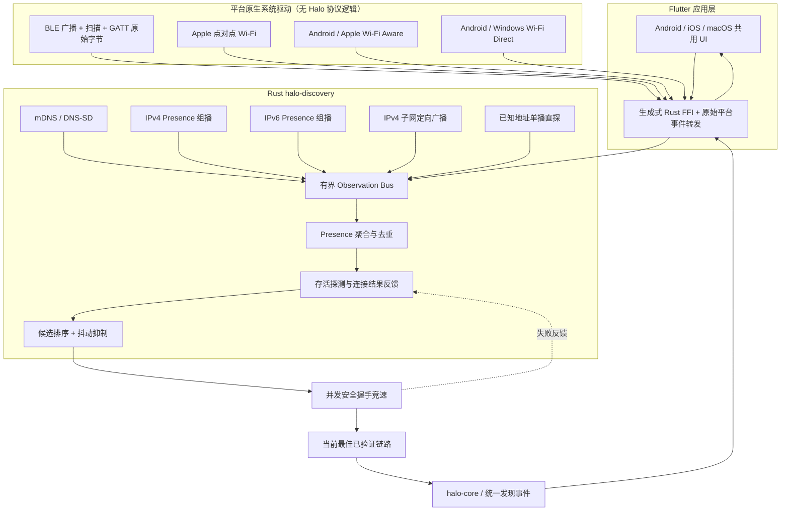
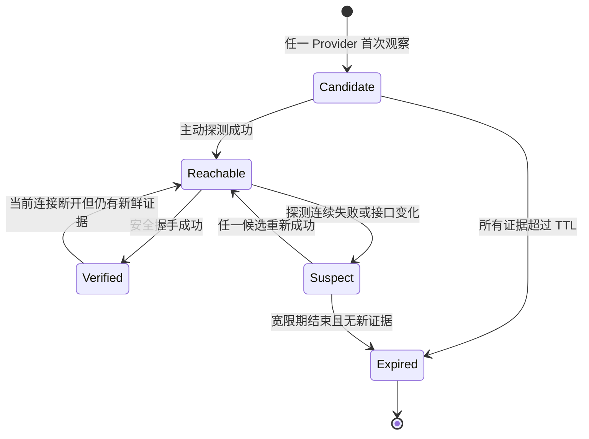

# Halo 设备发现与链路探测设计

- 状态：Android/macOS 为当前产品目标；iOS 与 Windows 产品能力后补
- 版本：Draft 1
- 日期：2026-07-28
- 当前验收组合：Android ↔ macOS、Android ↔ Android；macOS ↔ macOS 回归
- 后续协议目标：iOS/iPadOS、Windows

本文负责会合、Observation 和候选证据。Apple 点对点 Wi-Fi、Wi-Fi Direct、
Wi-Fi Aware 与局域网如何建立实际数据路径，以
[`data-channels.md`](data-channels.md) 为准。

## 1. 目标

Halo 的发现能力不能等同于“调用一次 mDNS，然后把回调展示出来”。它需要在权限、
网络、硬件和系统策略不断变化的环境中，尽快回答以下问题：

1. 附近有哪些正在运行 Halo 的设备？
2. 多个来源看到的是否是同一个临时在线实例？
3. 对方有哪些当前可用的连接候选地址或近场链路？
4. 哪条链路此刻真正可达、稳定，并且能完成安全握手？
5. 当前首选链路失败后，如何快速切换到其他候选而不让设备从 UI 中闪退？

第一阶段必须并行使用 BLE 和局域网发现。任何单一 Provider 失败，都不能让整个发现
会话失败。

## 2. 非目标与边界

- 发现结果不是身份。设备名、IP、BLE Peripheral、mDNS 实例和 Presence ID 都不可信。
- 只有后续 QUIC/TLS 与配对握手能够把临时端点绑定到设备公钥身份。
- 不通过 BLE 传输文件。BLE 用于近场存在性判断、跨链路关联和唤醒局域网探测。
- 不扫描整个网段的端口，不读取或上传 ARP/邻居表，不探测非 Halo 设备。
- 不逆向 AWDL、AirDrop、Quick Share 或其他私有协议。
- 不承诺应用进入后台后仍持续发现。各平台后台行为必须单独验证和标注。
- “最佳链路”不是信号最强或分数最高，而是完成了协议协商和安全握手的可用链路。

## 3. 总体架构



所有 Provider 同时运行并产生统一的 `Observation`。聚合层不在不同 Provider 之间做
“二选一”，而是保留来源证据和全部候选。连接阶段对排名靠前且路径独立的候选执行
带间隔的并发握手，实际成功者才成为当前链路。

## 4. 自动并行探测方案

### 4.1 基础 Provider

| Provider | 四端要求 | 主要价值 | 典型失效方式 | 是否产生 IP 端点 |
| --- | --- | --- | --- | --- |
| BLE Rendezvous | 必做 | 判断物理邻近，在 LAN 广播受限时仍能看到对方 | 权限拒绝、蓝牙关闭、广播能力不足 | GATT 会合后可以提供不可信候选 |
| mDNS/DNS-SD | 必做 | 标准零配置发现，多网卡处理较成熟 | 企业网过滤、多播受限、缓存陈旧 | 是 |
| IPv4 Presence 组播 | 必做 | 主动 query/response、快速 RTT 与离线刷新 | AP 隔离、IGMP/组播过滤 | 是 |
| IPv6 Presence 组播 | 必做 | 双栈和 IPv6-only 网络 | 接口 scope 错误、IPv6 被禁用 | 是 |
| IPv4 子网定向广播 | 必做 | 路由器不转发组播但允许广播时兜底 | 广播被禁、热点客户端隔离 | 是 |
| 已知地址单播直探 | 已配对设备必做 | 所有广播被禁时恢复历史设备 | DHCP 地址变化、跨网段、VPN 路由 | 是 |

“必做”表示代码、平台适配和测试矩阵都必须完成，不能只放一个空接口后宣称支持。

### 4.2 平台增强 Provider

| Provider | 适用范围 | 决策 |
| --- | --- | --- |
| Wi-Fi Aware/NAN | 支持该能力的 Android ↔ Android，以及受支持的 Android ↔ iOS/iPadOS 26 设备 | 正式计划 Provider；完成服务发现和独立数据路径，跨栈真机矩阵通过前保持 `planned` |
| Wi-Fi Direct Services | Android ↔ Android、Windows ↔ Windows、Android ↔ Windows | 正式计划 Provider；完成 Group 建立与 IP 端点发现，跨厂商矩阵通过前保持 `planned` |
| Apple Network.framework 点对点 Wi-Fi | Apple ↔ Apple | 正式计划 Provider；使用 peer-to-peer Bonjour/QUIC，不向 Android 或 Windows 宣称兼容 |
| UWB / Nearby Interaction | 部分 Apple/Android 设备 | 只适合测距或方向增强，不是通用发现入口，不纳入首批自动 Provider |
| Bluetooth Classic | 各平台行为不一致 | 需要更重的系统配对和可发现状态，收益低于 BLE，不纳入首批实现 |

平台增强 Provider 只有在运行时明确报告 `available` 时才启动。它们不能阻塞基础
Provider，也不能增加首次启动的必需权限；需要额外权限时必须在用户触发对应能力后请求。

### 4.3 手动兜底，不参与后台并行扫描

- 二维码：一端展示一次性会合信息，另一端扫码。
- 短连接码：通过用户选定的外部通道交换一次性信息。
- NFC：只在双方平台和硬件都支持时传递一次性会合信息。

这些方案能穿过复杂网络，但需要明确的用户动作，因此作为“找不到设备”的恢复入口，
不伪装成自动发现 Provider。

## 5. 跨 Provider 的临时 Presence

### 5.1 Presence ID

应用每次进入一次新的可发现周期时生成随机 128-bit `PresenceId`，所有并行 Provider
在该周期内使用相同值，从而允许聚合器把 BLE、mDNS 和 UDP 观察合并。

`PresenceId`：

- 不从设备密钥、账号、设备序列号、MAC 或 IP 派生；
- 不是配对身份，不能自动加入“可信设备”；
- 应在应用重新启动、用户停止后重新开始发现，或最长轮换窗口到期时更新；
- 轮换时允许旧值和新值有很短的重叠，以免 UI 闪断；
- 不能写入长期分析日志。

### 5.2 Presence Descriptor

所有 Provider 最终映射到同一个严格有界的描述：

```text
PresenceDescriptor
├── wire_version
├── presence_id[16]
├── protocol_min / protocol_max
├── capabilities[8]
├── sequence
├── ttl
├── endpoints[]
│   ├── transport = quic
│   ├── socket_address + interface_scope
│   └── source
└── optional rendezvous nonce
```

广播层不携带设备公钥、稳定设备 ID、文件名或人类可读设备名。UI 在安全握手前只能显示
通用名称，例如“附近的 Halo 设备”；完成握手后才能展示经过认证的设备资料。

## 6. BLE Rendezvous 设计

BLE 是首批四端必做 Provider。Kotlin、Swift 和 WinRT 代码只调用平台 BLE API，收发
Rust 生成的 opaque bytes，并把原始结果通过 Flutter 集成通道交回 Rust。Presence 的
编码、解析、语义校验与聚合都在 Rust 中完成，平台代码不得复制协议 codec。Rust 不
使用一个未经真机验证的通用 BLE crate 来掩盖平台生命周期差异。

### 6.1 角色

前台发现期间，每个支持的设备尽可能同时扮演：

- Peripheral/Advertiser：广播固定 Halo Service UUID，并提供 GATT 服务；
- Central/Scanner：按 Halo Service UUID 过滤扫描结果；
- GATT Client：对新 Peripheral 做短连接，读取 Presence Descriptor；
- GATT Server：提供临时 Presence 和 LAN 唤醒能力。

如果硬件不支持同时广播和扫描，平台适配器需要报告半双工能力，并使用带随机抖动的
角色轮换。不能静默关闭其中一侧。

### 6.2 广播载荷

跨四端可靠的最低公共部分只依赖：

- 一个固定的、项目拥有的 128-bit Halo Service UUID；
- 系统生成的临时 BLE Peripheral 标识；
- RSSI，仅用于 UI 的粗略距离桶和 GATT 调度，不用于身份或最终链路选择。

平台允许 Service Data 时，可以附带短生命周期的截断 Presence Token 和协议主版本，
以减少不必要的 GATT 连接；但算法不能依赖该扩展，因为不同平台对广播字段和长度限制
不同。禁止借用未分配的 Bluetooth SIG Company ID 发送正式产品数据。

### 6.3 GATT 服务

Halo BLE 服务至少包含：

1. `Presence`（Read/Notify）：返回有长度上限、带版本的 Presence Descriptor。
2. `WakeLanProbe`（Write/Notify）：扫描方写入随机 nonce；对方立即从全部可用 LAN
   接口发送 Presence response，并通过 Notify 返回执行结果。
3. `EndpointHints`（Read，可选）：返回有限数量的本地 QUIC 地址候选及 scope。所有
   地址仍是不可信输入，只能用于后续安全握手。

GATT 连接自身不能代替 Halo 配对。读取超时、MTU 分片、重复回调、设备离开、蓝牙状态
变化都必须转成结构化 Provider 状态。

### 6.4 GATT 调度

- 同时连接数量默认不超过 2，具体值由平台能力调整。
- 优先处理从未读取、RSSI 较高、最近没有失败的 Peripheral。
- 单次读取使用短超时；失败采用有上限的指数退避。
- 同一临时 Peripheral 的重复广播只刷新 RSSI 和最后观察时间，不重复建连。
- 读到完整 `PresenceId` 后，立即与 LAN Provider 的观察合并。
- BLE 消失不会立刻删除设备；只撤销 BLE 证据，等待其他来源及总 TTL。

### 6.5 平台实现要求

#### Android

- 使用 `BluetoothLeScanner`、`BluetoothLeAdvertiser`、`BluetoothGatt` 和
  `BluetoothGattServer`。
- Android 12/API 31 及以上按实际行为申请 `BLUETOOTH_SCAN`、
  `BLUETOOTH_ADVERTISE`、`BLUETOOTH_CONNECT` 运行时权限。
- Halo 不声明 `neverForLocation`。Android 官方说明该标志会过滤部分 BLE 广播，而且
  部分厂商的高版本系统即使已经授予“附近设备”权限，仍会在缺少
  `ACCESS_FINE_LOCATION` 时抑制扫描结果。因此 Android Demo 在启动发现时同时请求精确
  位置权限，但 Rust Core 与平台适配器不得推断、保存或传输物理位置。
- 运行时检查 BLE、广播、扩展广播和多广播实例能力，不以 Android 版本号代替能力判断。
- 权限已授予但系统级“位置信息”开关关闭时，厂商仍可能阻止扫描；该状态必须作为能力
  降级展示，不能伪装成“附近没有设备”。

#### iOS

- 使用 CoreBluetooth 的 `CBCentralManager`、`CBPeripheralManager`。
- `Info.plist` 提供准确的 Bluetooth 使用说明。
- 前台同时扫描和广播；后台不作为首版承诺。
- 不依赖广播包一定包含本地名称或扩展字段，核心 Presence 通过 GATT 获取。
- Apple CoreBluetooth 可能把 128-bit Service UUID 放入其他平台不可见的 overflow 区域；
  因此前台广播可以同时携带固定产品标记 `Halo` 作为候选回退。该标记不是用户设备名、
  身份或信任证据；对仅由名称命中的候选，仍必须发现 Halo GATT Service、读取完整
  Presence，并由 Rust 严格校验后才能进入聚合器。
- 处理系统对重复广播、扫描结果和应用生命周期的合并与节流。
- Provider 替换必须先同步注销旧的 Scan、Advertise 和 GATT 资源；旧实例的延迟事件通过
  generation token 丢弃，不能污染新会话。
- 切后台、权限撤销、蓝牙关闭或控制器重置时必须释放所有注册。回到前台后重新检查系统
  状态，不得把上一次的 `ready` 状态当作仍然有效。
- 扫描注册、广播注册和 GATT 读取失败分别采用独立的有上限指数退避；重复广播不得绕过
  单 Peer 退避形成连接风暴。

#### macOS

- 使用 CoreBluetooth，并区分沙盒、签名和不同分发方式下的权限行为。
- 当前 Demo 仅支持 Apple Silicon（arm64）；验证睡眠唤醒和蓝牙控制器重置。Intel 支持
  需要单独恢复并完成互操作验证后才能声明。

#### Windows

- 使用 WinRT `BluetoothLEAdvertisementWatcher`、
  `BluetoothLEAdvertisementPublisher` 和 GATT Provider/Client API。
- 打包应用声明 `bluetooth` capability；未打包桌面应用单独记录能力差异。
- 主动扫描功耗更高且后台不可用，只在前台快速窗口使用。
- 处理挂起、睡眠和控制器重置导致 watcher/publisher 状态变化。

## 7. LAN Provider 设计

### 7.1 mDNS/DNS-SD

- 服务类型：`_halo._udp.local.`。
- 实例名使用临时 Presence 派生值，不包含用户设备名。
- TXT 只包含 wire version、协议范围、能力位和完整 Presence ID。
- SRV 端口指向当前 QUIC 监听端口。
- 同时监听 resolved、removed、daemon/interface 状态；removed 只撤销该来源证据。
- mDNS 缓存可能在设备异常离线后继续存在，必须通过主动探测确认可达性。

iOS/macOS 应声明 `NSLocalNetworkUsageDescription` 和实际浏览的
`NSBonjourServices`；权限拒绝需要作为 Provider 状态展示，而不是空列表。

### 7.2 Halo Presence UDP

同一个固定长度 Presence 包用于以下三种路径：

- IPv4 organization-local multicast：`239.192.72.65:44721`，TTL 1；
- IPv6 transient link-local multicast：按接口 scope 加入组播，hop limit 1；
- 每个活跃 IPv4 接口根据地址和掩码计算出的 directed broadcast。

节点启动时发送 `query`，收到 query 的节点单播返回等长 `response`，稳态周期发送
`announce`，正常退出尽力发送 `goodbye`。接收方永远采用数据包来源地址与消息中的
QUIC 端口，不接受消息自报的 IP。

每个接口独立发送，接收 Socket 加入全部合格接口。Loopback、down、unspecified、
point-to-point 和不支持 multicast/broadcast 的接口必须按平台能力过滤。VPN 接口默认
不广播，除非用户或企业策略明确开启。

### 7.3 已知地址单播直探

配对记录可以保存最近成功的 discovery endpoint 列表和网络作用域摘要，但不保存为
永久正确地址。发现启动后，单播 Provider 对这些地址发送带 nonce 的 query：

- 响应必须返回预期 Presence 或在安全连接后绑定到预期设备公钥；
- 每个目标有独立退避和失败计数；
- DHCP 地址失效不会阻塞其他 Provider；
- 不向未配对设备历史地址发探测；
- 网络环境明显变化后降低历史地址优先级。

## 8. 并行调度与功耗控制

“并行”不表示所有无线能力永久以最高频率运行。发现会话分为三个阶段：

### 8.1 Fast Window（默认前 8 秒）

- BLE 主动扫描与广播同时启动；
- mDNS browse/publish 启动；
- IPv4/IPv6 query 立即发送，并在短窗口重试；
- directed broadcast 发送一次；
- 已配对地址立即并发直探；
- 可用的平台增强 Provider 同时启动。

目标是最低的首个可用设备时间，而不是最低瞬时功耗。

### 8.2 Steady Window

- BLE 降低扫描强度或采用平台允许的节流策略；
- mDNS 保持订阅；
- UDP announce 使用带随机抖动的较长间隔；
- 只有仍不可达或近期活跃的已配对设备继续直探；
- 已稳定连接的设备降低发现频率，但保留链路健康检查。

### 8.3 Recovery Window

当网络接口、蓝牙状态、系统唤醒、权限或前后台状态变化时：

1. 旧接口上的候选立即标记为 `suspect`，不马上删除；
2. 重建受影响的 Socket/原生会话；
3. 短暂重入 Fast Window；
4. 新链路安全握手成功后切换；
5. 超过 TTL 且无其他证据时才移除设备。

所有周期、并发数和退避初值都是可配置实验参数，必须通过发现延迟、CPU、网络包量和
移动端能耗数据确定，不能凭感觉固化。

## 9. 聚合、去重与状态机

### 9.1 Observation

每个 Provider 提交：

```text
Observation
├── provider_id
├── presence_id
├── observed_at（单调时钟）
├── expires_at / ttl
├── protocol_range
├── capabilities
├── endpoints[]
├── rtt（若实际测得）
├── signal_bucket（BLE 可选）
└── interface_id / scope（可选）
```

队列必须有界。Provider 在队列满时按策略合并相同 Presence 的刷新事件，但不得丢弃
Provider failure、peer goodbye 或安全相关状态。消费者落后时返回 `lagged`，由消费者
读取快照恢复，禁止无限堆积。

### 9.2 Peer 状态



Flutter 可以展示 Candidate/Reachable，但只有 Verified 可以显示可信设备资料并执行
自动信任策略。

### 9.3 合并规则

- 主键是本次发现周期的完整 `PresenceId`。
- 相同 Presence、相同 SocketAddress、相同 interface scope 合并为一个候选。
- 同一候选保留所有独立来源证据，不让后来的低质量观察覆盖已测 RTT。
- 协议范围冲突时标记异常，不取更宽范围。
- 能力位按同一 sequence 的一致结果处理；冲突触发重新探测。
- 只有一个 Provider goodbye 时，只移除该 Provider 的证据。
- 自己的 Presence 在所有入口统一过滤。

## 10. 最佳链路选择

### 10.1 先排序，再实测

排序只决定尝试顺序，不能决定信任。候选基础分考虑：

- 是否与本机协议版本有交集；
- 是否有两个以上独立 Provider 交叉印证；
- 是否有近期 nonce response 或真实连接成功；
- 近期 RTT、连续成功次数、最后成功时间；
- 连续失败、超时、接口已消失、地址 scope 不完整；
- 是否与当前网络接口和地址族匹配；
- 是否会打断现有网络，例如 Wi-Fi Direct 重新组网。

BLE RSSI 只表示粗略近场程度，不能让一个不可达 IP 获得更高连接优先级。

### 10.2 带间隔的并发握手竞速

```text
t=0ms     尝试排名第 1 的候选
t=100ms   若尚未完成，尝试不同接口/地址族的第 2 候选
t=250ms   若仍未完成，尝试第 3 候选或平台近场数据路径
成功      取消其余尝试，记录 RTT 与握手结果
失败      结构化回报原因，更新候选稳定性并尝试后备
```

具体间隔需要实测调优。最多并发数必须有界，避免同一设备创建连接风暴。

### 10.3 稳定性与防抖

- 已验证且健康的当前链路具有粘性，不因一次更低 RTT 就切换。
- 新候选只有分数明显更高并连续成功，或当前链路失败，才触发切换。
- 网络切换时允许 make-before-break：新链路认证成功后再关闭旧链路。
- 连续失败快速降权，偶发单次超时不会永久封禁。
- 每个失败原因分别记录：permission、no-route、timeout、refused、protocol、auth。
- `auth` 失败不能自动换地址后忽略，必须上升到安全事件处理。

最终结果应表达为：

```text
SelectedLink
├── verified_peer_key
├── endpoint
├── transport
├── supporting_sources[]
├── measured_handshake_rtt
├── selected_at
└── alternatives[]
```

## 11. Rust 与平台边界

Rust `halo-discovery` 负责：

- Provider 生命周期、取消和健康状态；
- mDNS、UDP multicast/broadcast、known-peer direct Provider；
- Presence 解析、严格校验、聚合、TTL、排序和连接反馈；
- 快照与有界事件流；
- 所有跨平台一致的状态机。

Flutter 负责：

- Android、iOS、Windows、macOS 共用的界面、导航和无障碍；
- 在系统权限弹窗前解释用途；
- 把 Rust 提供的 opaque BLE 广播值交给平台驱动；
- 把平台驱动产生的原始字节和状态转发给 Rust，并渲染 Rust 返回的统一快照。

Flutter 不解析 Presence，不合并设备，不选择链路，也不拥有发现状态机。

平台原生代码只负责：

- BLE scanner/advertiser/GATT client/server；
- Android 与 Apple Wi-Fi Aware；
- Android 与 Windows Wi-Fi Direct；
- Apple Network.framework 点对点 Wi-Fi；
- 权限、系统状态、前后台与硬件能力回调；
- 传递原始字节和会话内临时句柄，不构造 `Observation`。

Rust FFI 不暴露原生对象，只提供粗粒度会话操作：

```text
discovery_start(config) -> opaque_ble_presence
discovery_submit_ble(platform, opaque_bytes)
discovery_report_ble_state(platform, raw_status)
discovery_snapshot() -> merged_peers
discovery_stop()
```

`peripheral_handle` 只在当前平台会话内有效，不能持久化，也不能越过安全身份边界。

## 12. Provider 健康状态

每个 Provider 必须公开状态，UI 和诊断不能把“没有设备”与“能力不可用”混为一谈：

```text
starting
ready
degraded(reason)
permission_required(permission)
permission_denied(permission)
hardware_off
unsupported
temporarily_unavailable(retry_at)
failed(recoverable, error_code)
stopped
```

总发现状态由聚合器计算。只要有一个有效 Provider 仍在运行，会话就可以继续；同时将
受损能力明确展示给用户。

## 13. 安全、隐私与滥用防护

- 所有网络包和 GATT 数据都按不可信输入处理，先检查固定上限，再解析。
- UDP response 不得大于 query，降低反射放大风险。
- 按来源 IP、BLE Peripheral 和 Provider 做令牌桶限速。
- 限制同一时间的 Presence 数、每个 Presence 的候选数、GATT 连接数和握手数。
- 不响应格式错误、版本不支持、端口为零或保留字段异常的包。
- 不在发现层发送稳定设备公钥和人类可读设备名。
- 日志对 Presence、IP、Peripheral handle 做会话级散列或截断，不记录完整值。
- 拒绝权限后不循环弹窗，不将权限拒绝伪装成网络错误。
- 对来自 BLE 的 IP hints 检查地址类型、scope、端口和当前接口可达性。
- 安全握手身份不匹配时，隔离该 Presence 的所有候选并通知上层。

## 14. 配置与平台声明

### iOS/macOS

- `NSLocalNetworkUsageDescription`
- `NSBonjourServices` 包含 Halo 实际服务类型
- Bluetooth 使用说明键按最低系统版本配置
- Apple 点对点 Wi-Fi 的 Network.framework browser/listener 显式启用 peer-to-peer
- iOS/iPadOS 26 Wi-Fi Aware 的 `com.apple.developer.wifi-aware` entitlement 与
  `WiFiAwareServices` 声明（仅启用该 Provider 时）
- App Sandbox/network client/server entitlement 按分发模型验证

### Android

- `INTERNET`、网络状态和组播相关能力
- Android 12+ 的 `BLUETOOTH_SCAN`、`BLUETOOTH_ADVERTISE`、
  `BLUETOOTH_CONNECT`
- Android 13+ Wi-Fi Aware 所需 `NEARBY_WIFI_DEVICES`（启用该 Provider 时）
- Wi-Fi Direct 所需网络、附近 Wi-Fi 设备与旧系统位置权限按目标版本配置
- 旧系统 Location 权限只按实际系统要求申请
- mDNS/组播运行期间正确持有并及时释放 `MulticastLock`

### Windows

- 打包应用的 `bluetooth`、网络 client/server 等 capability
- Wi-Fi Direct 的 `Proximity` capability 和系统配对/连接 UI
- 防火墙规则由安装或首次监听流程明确处理
- 未打包 Win32 与 MSIX 分发分别验证

权限清单必须由平台代码和自动检查生成或校验，避免文档与产物漂移。

## 15. 测试策略

### 15.1 Rust 自动测试

- Presence 固定包的 golden vectors、截断、超长、未知版本和随机输入
- Provider 同时上报、乱序、重复、goodbye、TTL 到期和时钟推进
- 多源合并、协议冲突、候选上限和事件队列背压
- 排序确定性、连续失败降权、成功恢复和链路防抖
- Provider panic/error/永久挂起时其他 Provider 继续运行
- Socket 取消后端口、任务和 channel 均被释放
- IPv4/IPv6 scope 与 directed broadcast 计算属性测试

### 15.2 双机与多机网络矩阵

- Android ↔ iOS、Android ↔ Windows、Android ↔ macOS
- iOS ↔ Windows、iOS ↔ macOS、Windows ↔ macOS
- 同平台组合也必须验证 BLE 和平台增强 Provider
- 2.4 GHz、5 GHz、6 GHz、双栈、IPv4-only、IPv6-only
- 家用路由器、手机热点、企业 Wi-Fi、访客网、AP isolation
- mDNS 被禁、IPv4 multicast 被禁、IPv6 被禁、broadcast 被禁的单项故障
- VPN、多网卡、有线 + Wi-Fi、接口地址变化、DHCP 续租
- 睡眠/唤醒、锁屏/解锁、前后台切换、蓝牙关闭再开启
- 权限首次允许、拒绝、设置中重新开启

### 15.3 BLE 真机矩阵

- 每个平台至少两类主流控制器/芯片组
- 同时 scan + advertise 能力与半双工回退
- GATT MTU、长读、超时、断连、重复发现和服务缓存
- Android 厂商节流差异
- Windows watcher/publisher 在 suspend/resume 后恢复
- iOS/macOS CoreBluetooth 状态恢复和系统节流
- 10 个以上 Halo 广播设备时的连接队列与内存上限

模拟器只能验证状态机和 FFI，不算 BLE 或局域网发现通过。

## 16. 观测指标

所有指标默认只保存在本地诊断会话中，并去标识化：

- 各 Provider 的启动成功率、首次观察时间、错误原因
- 从首次观察到首次主动探测成功的时间
- 从用户选择到安全握手成功的时间
- 每个候选的探测成功率、RTT 分布、连续失败数
- 多源交叉印证比例
- 错误删除、重复设备、UI 闪现次数
- Fast/Steady Window 的 CPU、包量、内存和移动端能耗
- 链路竞速中胜出 Provider/地址族，但不记录完整地址和 Presence

性能报告必须注明设备、OS、网络、路由器、距离和权限状态。

## 17. 首批验收标准

以下条件全部满足后，才能称为“四端发现可用”：

1. BLE、mDNS、IPv4 multicast、IPv6 multicast、directed broadcast 在支持的平台上
   有真实实现和结构化能力报告。
2. Android、iOS、Windows、macOS 均通过真实设备 BLE 广播、扫描和 GATT 会合。
3. 任意单个基础 Provider 被人为禁用时，其他 Provider 继续发现，不重启整个会话。
4. 同一个设备被三个 Provider 观察时，UI 只出现一个条目，且保留三个来源证据。
5. mDNS 返回陈旧地址时，主动探测能将其降权并选择实际可达候选。
6. 多地址环境中通过真实安全握手选出链路；首选失败能自动回退。
7. 权限拒绝、蓝牙关闭、组播被禁与“附近确实没有设备”在状态上可区分。
8. 所有解析器通过截断、畸形、资源上限和模糊测试，无 panic 和无界分配。
9. 发现停止后，原生扫描、广播、Socket、任务和锁在规定时间内全部释放。
10. 发布包含完整的六组跨平台互操作结果和已知限制，不以单机 loopback 代替。

发现耗时和功耗的具体发布门槛在第一轮真机基线后确定。基线前可以记录实验目标，但
不能把未经测量的数字写成产品能力。

## 18. 实现顺序

实现仍按可验证的垂直切片推进。当前只交付 Android 与 macOS，公共协议继续保持可移植：

1. 固化统一 Observation、Provider、Presence 包、聚合和排序契约。
2. 完成 IPv4/IPv6 multicast、directed broadcast、known-peer direct 与 mDNS。
3. 定义 Native Provider FFI 和 BLE GATT 字节协议。
4. 建立唯一 Flutter Demo 和 Rust FFI，完成 macOS 与 Android 的纯系统 BLE 驱动，
   并通过同一 Flutter + Rust 会话覆盖 Android ↔ macOS、Android ↔ Android；macOS ↔
   macOS 作为回归路径。
5. 接入真实 QUIC/TLS 握手竞速与连接结果反馈。
6. 完成网络切换、权限变化、睡眠唤醒和资源释放。
7. 完成共同 Wi-Fi 优先、用户准备热点次之的本地路径策略；热点可能被系统标为
   计费/昂贵，但只允许用户明确选择、精确绑定且对端本地可达的候选。首个切片支持
   Android 与 macOS 加入端；端点自身创建热点需要单独证明宿主接口所有权。
8. 完成 Android ↔ macOS、Android ↔ Android 真机矩阵与 macOS ↔ macOS 回归、模糊
   测试、压力测试、功耗基线和发布报告。
9. Android/macOS 里程碑完成后，再恢复 iOS/iPadOS、Windows、Apple 点对点 Wi-Fi、
   Wi-Fi Direct 与 Wi-Fi Aware 的产品接线和真机矩阵。

蜂窝网络、公网会合、NAT 穿透和云端中继不属于后补项，而是明确不支持的边界；只有
蜂窝网络时返回“无可用传输路径”。平台与通道顺序见 ADR 0010。

不允许先做一个永远返回成功的 BLE stub，再把 README 状态改成 supported。

## 19. 当前状态

截至 2026-08-05：

- Rust 多 Provider 管理器、Observation 聚合、TTL、排序、连接结果反馈和安全隔离已实现；
- mDNS、IPv4 multicast + directed broadcast、IPv6 multicast 和 known-peer direct
  Provider 已实现；
- Presence v1 固定包、显式 reply port、BLE Presence codec 和 GATT UUID 已冻结为
  实验协议并有自动测试；
- 本机两个独立进程已经通过 mDNS、IPv4 和 IPv6 三源发现同一个 Presence，测得主动
  response RTT 并完成退出清理；这不代替跨设备验证；
- iOS/macOS 共用的 CoreBluetooth scan、advertise、GATT read 和 Wake-LAN 系统驱动
  已接入同一 Flutter UI；iOS arm64 iPhoneOS 构建已通过，但尚未进行 iOS 真机互测；
- Android BLE 系统驱动已经接入同一 Flutter UI；Kotlin 只调用系统 API 并搬运 Rust
  Presence 字节，不包含 Presence codec 或发现业务状态机；
- Rust 已把共享 LAN 与用户授权热点建模为不同作用域，前者自动路径只接受非计费网络，
  后者必须经过显式用户操作且优先级更低；Android 加入端使用
  `WifiNetworkSpecifier` 和精确 `Network.bindSocket`，macOS 使用当前 Wi-Fi 授权与
  `IP_BOUND_IF`。两端加入外部热点的代码接线和主机构建已通过，仍待统一真机验证；
- `halo-ffi` 已接入 Rust DiscoveryManager，BLE 原始字节必须经过 Rust codec 和聚合器，
  相关跨边界自动测试已经通过；
- Android ↔ macOS 已在真机上完成双向发现验证；UI 可显示完整 Presence ID、设备类型、
  聚合来源和 Rust 报告的各 Provider 运行状态；
- Windows BLE 系统驱动尚未实现。

因此当前状态是“Android/macOS 真机发现已验证 + Android ↔ macOS 与 Android ↔
Android 文件传输待统一验证 + iOS arm64 基础构建保留 + Windows 待实现”。当前产品
里程碑不宣称 iPhone/iPad 或 Windows 支持，也不代表发现到的设备已经通过身份认证。

## 20. 官方平台资料

- [Android Bluetooth permissions](https://developer.android.com/develop/connectivity/bluetooth/bt-permissions)
- [Android Wi-Fi Aware overview](https://developer.android.com/develop/connectivity/wifi/wifi-aware)
- [Android Wi-Fi Direct overview](https://developer.android.com/develop/connectivity/wifi/wifi-direct)
- [Apple CoreBluetooth data transfer](https://developer.apple.com/documentation/corebluetooth/transferring-data-between-bluetooth-low-energy-devices)
- [Apple TN3151 networking API guidance](https://developer.apple.com/documentation/technotes/tn3151-choosing-the-right-networking-api)
- [Apple Wi-Fi Aware](https://developer.apple.com/documentation/WiFiAware)
- [Apple NSBonjourServices](https://developer.apple.com/documentation/bundleresources/information-property-list/nsbonjourservices)
- [Windows Bluetooth LE advertisements](https://learn.microsoft.com/en-us/windows/apps/develop/devices-sensors/ble-beacon)
- [Windows Wi-Fi Direct services sample](https://learn.microsoft.com/en-us/samples/microsoft/windows-universal-samples/wifidirectservices/)
